<div align="center">

# 🐟 鲤慧 · LiHui

**基于百度地图开放能力的「15 分钟生活圈」智能体检与规划助手**

*15 分钟，看清你的生活半径。*


</div>

---

## 🌐 在线体验

同一套后端，三种入口，打开即用：

| 入口         | 形态                        | 说明                                      |
| ---------- | ------------------------- | --------------------------------------- |
| **网页版**    | 浏览器直接打开                   | 自动定位 + 生活圈体检 + 便民速查 + 真实店源，**零安装、扫码即用** |
| **微信小程序**  | 微信扫一扫                     | 地图主页 / 商城 / 订单 / 模型与语音，全功能端             |
| **多端 APP** | Android / HarmonyOS / iOS | uni-app 工程，同一套 UI 规范                    |

```bash
# 网页版本地起服务后浏览器访问（根路径即网页，/server-info 是原 JSON 自述）
node 03-lh-server/src/app.js     # → http://localhost:8809/
```

> 网页版把浏览器 **WGS-84 定位在前端内联换算成 GCJ-02** 再打接口，  
> 与小程序 `wx.getLocation({ type: 'gcj02' })`、百度返回值共用同一坐标系，避免「偏 500～900 米」。

**网页版真机渲染**（自动定位 → IP 兜底 → 天气 → 生活圈体检 → 真实店源）：

<div align="center">

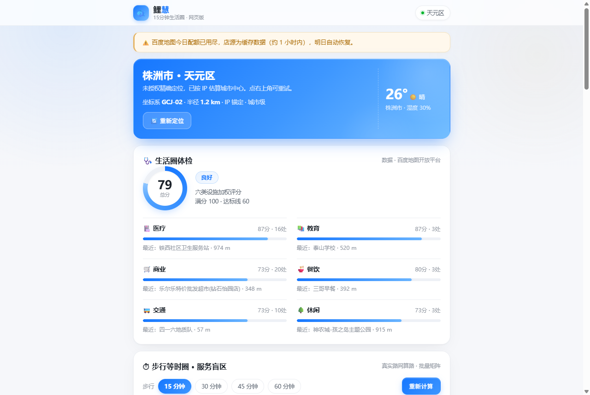

</div>

---

## 📖 项目简介

**鲤慧**是一套「**一码多端 + 服务端中转 + MCP 工具生态**」的地图智能助手：

- 客户端只负责「**呈现 + 采集**」；
- 百度地图能力、大模型调用、MCP 工具调度、Token 计量全部由服务端**统一中转**；
- 从而做到三件事：**AK 不落端、能力可插拔、成本可核算**。

围绕赛题核心「15 分钟生活圈」，鲤慧为每一类人群回答三个问题：

> 🏥 我的生活圈**缺什么**？（六类设施体检评分）  
> 🚶 缺的东西**去哪补**？（周边检索 + 路线规划）  
> 💬 补的过程**谁帮我**？（AI 助手 · MCP 工具编排 · 语音交互）

---

## 📱 真机一览

| 地图主页 · 便民服务 | 生活圈体检报告 | 个性化生活圈方案 |
| :---------: | :------: | :-----: |
| 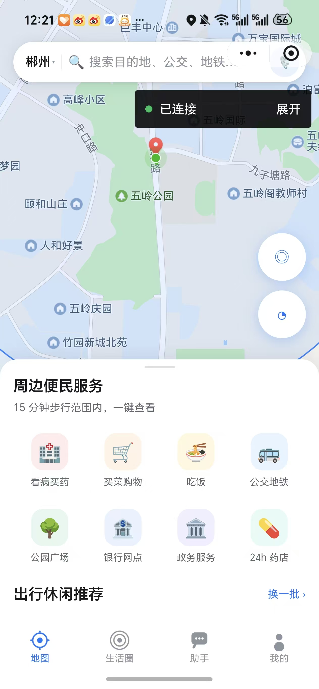 | 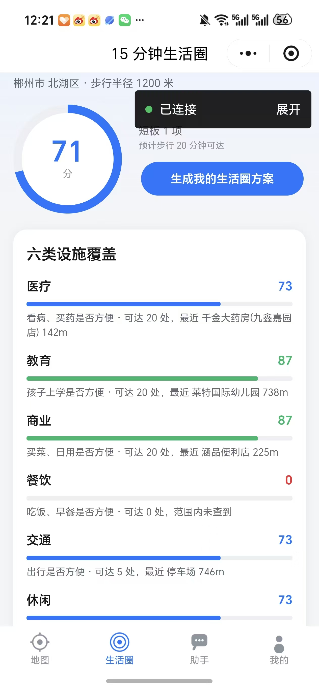 | 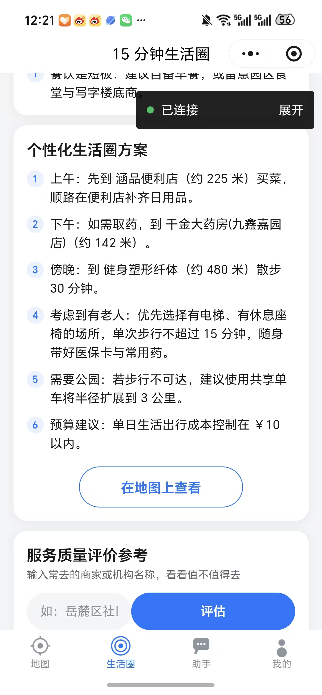 |

| AI 助手 · MCP 编排 | AI 助手 · 情绪关怀 | AI 助手 · 周边问答 |
| :---: | :---------: | :-----------: |
| 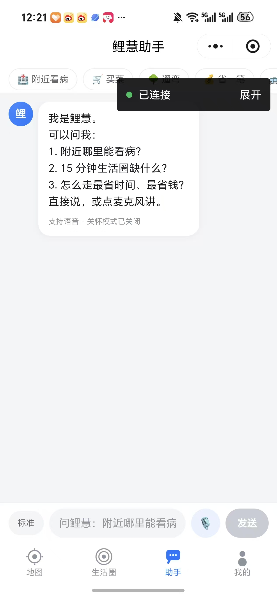 | 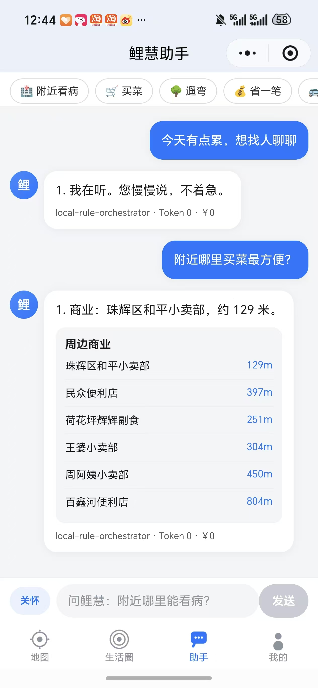 | 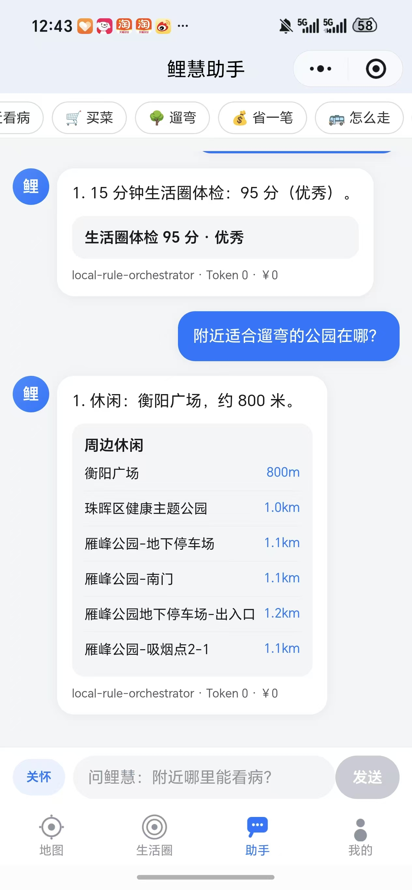 |

| 体检 · 六类雷达图 | 等时圈 · 15 分钟档 | 等时圈 · 服务盲区 |
| :-------------: | :--------: | :-----: |
| 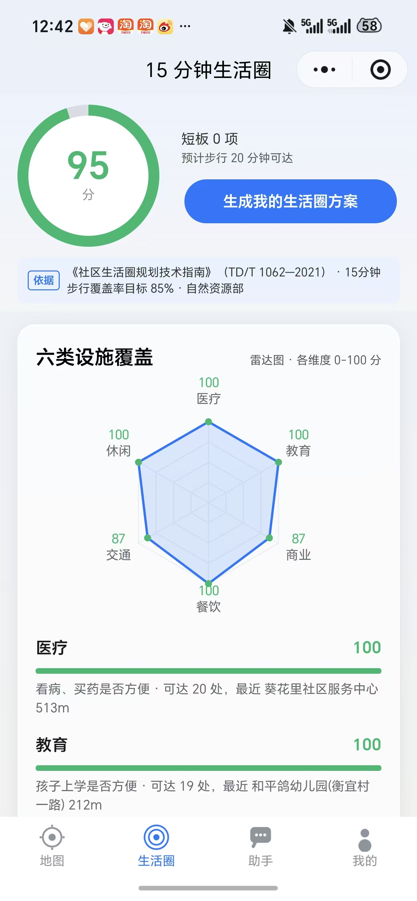 |  | 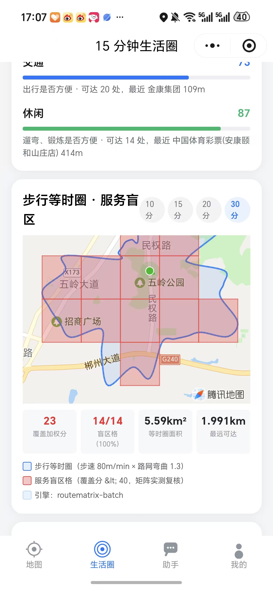 |

| 鲤慧商城 · 定位 3km 热门 | 我的订单 · 第三方支付 | 出行休闲 · 今日天气 |
| :---------: | :-----------: | :-----: |
| 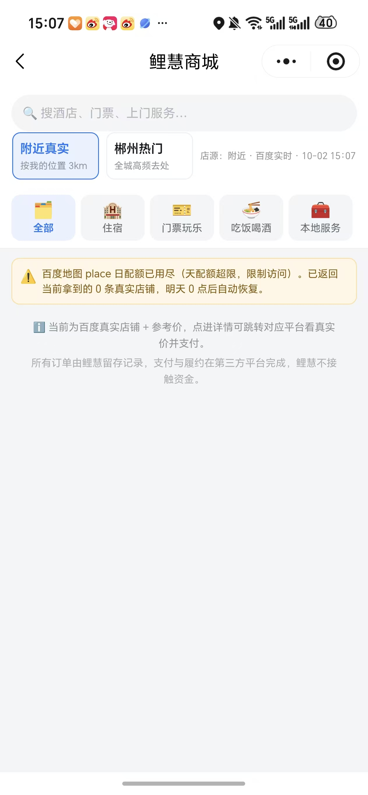 | 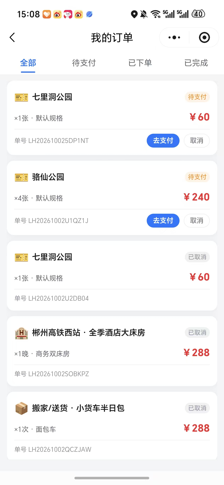 | 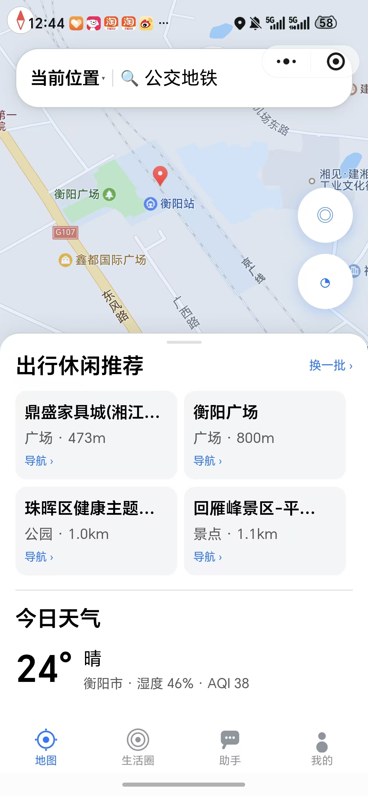 |

| 模型与语音 · 6 类供应商 | 设置 · 夜间玻璃拟态 | Token 用量 · 平台信息 |
| :-------------: | :--------: | :-------------: |
| 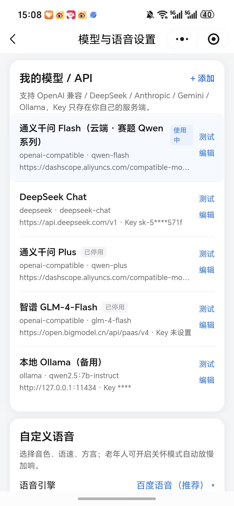 | 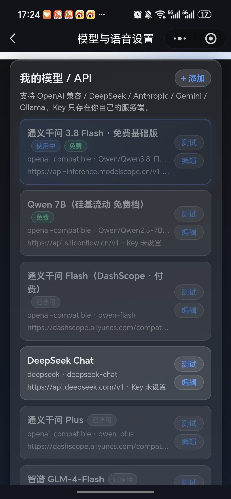 | 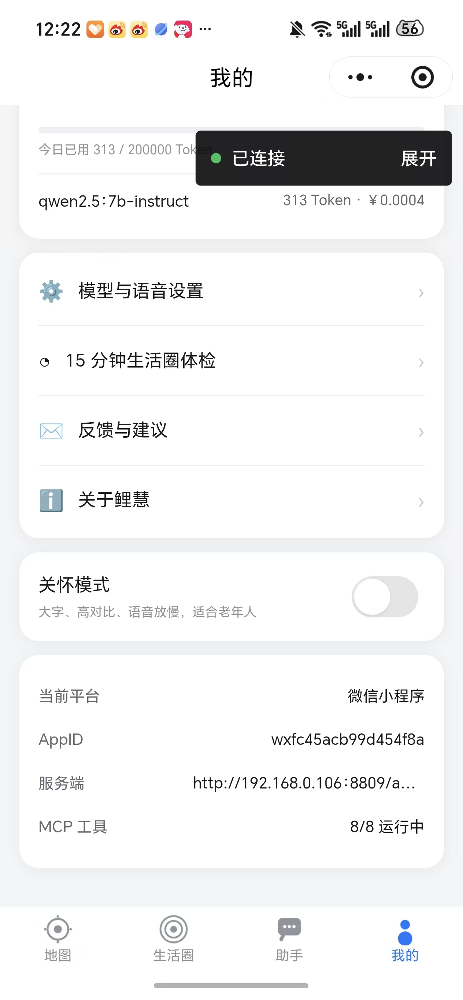 |

> 商城页全部店名 / 地址 / 电话来自**百度地图 place 实时检索**（按当前定位 3km 拉取，非内置假数据）；  
> 配额耗尽时前端弹提示条并回落到最近一次可用结果，**不白板**。

---

## 🆕 2026-10-06 更新

| 更新 | 说明 |
|---|---|
| 🧠 **用户画像自动学习 + 个性化推荐** | 端上静默埋点（搜索 / 对话话题 / 点店 / 导航，5s 节流、失败零打扰）→ 服务端**增量聚合 + 每日 ×0.98 衰减**（30 天不来的习惯自然淡化）；搜索结果**同距离带内重排**（常去店 +25 / 常搜词 +8 / 常搜类目 +4，距离仍是第一权重）；AI 助手注入画像摘要，主动给「顺路组合」建议；设置页新增「个性化推荐」开关，关闭即停报，只存地点与类目、**不采集任何身份信息** |
| 🚨 **危险自动响应分级（蜜罐后补丁）** | L1 单次踩蜜罐封 IP 10min → L2 同 IP ≥3 次封 24h → L3 1h 内 ≥3 个不同 IP 命中同一渠道判定**渠道泄露**，自动轮换该渠道蜜罐密钥（旧假钥匙即刻作废）；新增 `GET /security/events` 安全事件面板（最近事件 + 封禁名单 + 蜜罐状态） |
| 🛡 **API 密钥安全升级（蜜罐 + 全链路收敛）** | 排查出 **3 个真实泄露渠道**并全部封堵：`/map-home` 页面不再注入服务端真 AK（改浏览器端 AK / 蜜罐）、等时圈静态图改**服务端代理回传**（端上只见代理地址不见 ak）、`/bmap/proxy` 收紧为**百度域白名单**（堵 SSRF：裸 IP / 内网地址一律 403）；新增 `utils/security.js` 安全层——**4 把蜜罐假密钥**散布在页面与模板中，谁拿蜜罐来请求 → `security.log` 记录 IP / 渠道 / UA + 封禁 10 分钟；配置篡改自检告警。**密钥只存 `.env`（本地）与云托管环境变量（云端），源码零密钥** |
| 🚦 **高并发防护** | 百度出站**令牌桶限流**（`BAIDU_QPS` 可配，默认 30）——高并发排队而非瞬间打爆配额；相同参数请求 **in-flight 去重合并**（实测 3 并发只算 1 次，多端同页不雪崩）；JSON 存储**原子写**（tmp+rename，防半截文件静默丢数据） |
| 🗺 **地图 3D 视角** | 全部 3 张交互地图开启 `enable-3D` 楼块立体 + 26° 初始倾角（生活圈）/ 18°（首页）+ 双指俯仰 / 旋转手势 + 指南针回正，百度地图 App 同款 3D 观感 |
| 🌙 **全页夜间玻璃拟态** | 光斑改 `.lh-page::before/::after` 伪元素**全局生效**（9 页自动获得蓝 / 绿双色光斑，免逐页改造）；暗色玻璃卡白色占比提升、「我的」页全量玻璃化；顺带修复商品 / 订单详情页 theme-dark 类丢失导致暗色失效的 bug |

---

## 🆕 2026-10-05 更新

| 更新 | 说明 |
|---|---|
| 🌙 **夜间 / 白天主题切换** | 全局 CSS 变量双主题色板，**11 个页面**全部接入（含导航栏 / tabBar 跟随换色）；设置页一键切换，本地持久化，全项目 60+ 处硬编码背景色清零 |
| 📊 **体检报告雷达图** | 六类设施覆盖 canvas 2d 雷达图（4 层网格 + 得分多边形），明暗主题感知配色，报告刷新自动重绘 |
| 📜 **各地管理规范库（评分依据）** | 内置**国家《社区生活圈规划技术指南》（TD/T 1062-2021）** + 上海 / 长沙 / 深圳 / 苏州 5 份规范（含量化指标）；`GET /life/standards?city=` 按定位城市自动匹配适用标准，体检报告显示「依据」徽章，点击展开原文摘录；端上 7 天缓存 + 云端存储 |
| 🕳 **服务盲区识别分析面板** | 盲区面积（公顷）、绕行系数（真实可达 ÷ 理想直线）、分类缺口率（盲区格里菜场 / 药店 / 学校超时比例）、**优先改造地块**（盲区格 4-邻接连通聚类 × 面积 × 缺口强度 Top3，可一键导航） |
| 🗺 **百度底图模式** | 微信 `<map>` 组件底图由平台固定腾讯渲染（代码层无法更换），新增百度静态图 API 渲染同一份等时圈（GCJ→BD-09 转换 + 自适应缩放），一键查看真正的百度底图并可发起百度导航；算路 / 检索 / 底图数据源全栈百度开放平台 |
| 🆓 **免费基础版定型** | 默认套餐改为「免费基础版」（不调用任何付费 API）；默认模型「通义千问 · 免费基础版」（ModelScope 免费推理，每天 2000 次），设置页模型列表带「免费」徽标；欠费渠道自动停用不挡道 |
| ⚡ **分析速度优化** | 等时圈六类设施检索与批量路网矩阵**并行计算**（省 1.5~2s）；POI 检索结果 5 分钟共享缓存（重复请求毫秒级返回，不再重烧百度配额）；小程序体检与等时圈**并行发起**（首屏 ≈ 两者中较慢者，而非之和）；等时圈**渐进呈现**——计算期间先画理论估算圆，真实路网圈到达后自动替换，首屏即刻有图 |

---

## 🆕 2026-10-04 更新

| 更新 | 说明 |
|---|---|
| ⏱ **等时圈档位化** | 默认 **15 分钟（赛题口径）**，可选 30 / 45 / 60 档；30 分钟档真机实测：真实等时圈 5.59 km² vs 直线圆 18.10 km²（−69%），最远可达 1991m |
| 💰 **订单金额口径统一** | 以用户在详情页确认那一刻的单价为准落库（`unitPrice`），金额统一四舍五入到分；订单详情新增「单价 / 小计 / 应付金额」与参考价说明，杜绝「看到 386、订单记 358」 |
| 📍 **地址补查（用户共创）** | 地图上地址缺失 / 有误 / 没有的地点，用户一键补报 → 云端留存 → **所有人的检索结果自动覆盖 / 注入**（带「用户补充」标），同地点去重计票防灌水 |
| 📡 **定位变化广播** | App 内置轻量事件总线，定位落定即广播；首页 / 生活圈静默同步（移动 >80m 刷新中心点，>200m 连周边推荐 / 天气 / 搜索一起重刷） |
| 🤖 **默认模型切换免费 Qwen** | 默认走 **ModelScope 魔搭免费推理**（Qwen2.5-7B-Instruct，每天 2000 次 0 元），付费渠道（DashScope / DeepSeek）默认停用；token 支持环境变量 `MODELSCOPE_TOKEN` 注入，云端部署零代码 |
| 🛡 **网络降级回落** | 微信云托管 `callContainer` 失败自动降级 `wx.request` 重试，单通道故障不再导致全端白板 |

---

## ✨ 核心功能

### 🆓 免费基础版（开箱即用，无需任何 Key）

| 功能              | 说明                                                                          |
| --------------- | --------------------------------------------------------------------------- |
| 📍 **IP 自动锚定**  | 端上 GPS 校正 → 百度 IP 定位 → 逆地理补区县 → 内置城市兜底，四级策略链                                |
| ⏱ **步行等时圈**    | 真实路网批量算路（非直线圆）：36 方向二分收敛 + 盲区网格判定，默认 15 分钟档（赛题口径，15/30/45/60 可选）                      |
| 📍 **地址补查共创** | 地址缺失 / 有误就地报，「＋补充地点」收录地图上没有的点，云端同步全员生效                    |
| 🎯 **生活圈体检**    | 六类设施加权评分（医疗 25% · 商业 20% · 交通 20% · 教育 15% · 餐饮 10% · 休闲 10%），短板定位 + 步行可达分析                   |
| 🔍 **周边便民检索**   | 看病买药 / 买菜购物 / 公交地铁 等 8 类一键直达，复合关键词自动拆分检索                                    |
| 🗺 **路线规划**     | 步行 / 骑行 / 驾车（实时避堵）/ 公交四种模式，省钱方案对比                                           |
| 🗣 **语音交互**     | 录音 → 识别 → 播报全链路，自定义音色 / 语速 / 方言 / 唤醒词                                       |
| 👵 **关怀模式**     | 一键适老化：大字号、高对比（WCAG AAA）、慢速语音、单步引导                                           |
| 💰 **Token 计量** | 按天 / 设备 / 模型聚合记账，配额校验，本机实测 313 Token ≈ ¥0.0004                              |

### 🔑 接入 API 后（能力全开）

| 功能              | 说明                                                                   |
| --------------- | -------------------------------------------------------------------- |
| 🤖 **AI 助手**    | 意图识别 → MCP 工具编排 → 汇总生成人性化回复 + 结构化卡片                                  |
| 🌐 **多供应商模型**   | OpenAI 兼容 / Anthropic / Gemini / Ollama / 百度千帆 / DeepSeek，客户端可视化增删改测 |
| 🧩 **MCP 工具生态** | 8 个 MCP Server 即插即用，支持从 ModelScope 检索安装                              |
| ☀️ **天气与景区**    | 实时天气 + AQI，周边出行休闲推荐                                                  |
| 🖥 **桌面动作**     | 生成 `baidumap://` 等 URI Scheme，一键跳转地图 App 导航                          |

---

## 💡 十二个创新点（工程 · 产品 · 合规）

### 1️⃣ 坐标系统一治理引擎 —— 把「偏 500~900 米」当系统性问题根治

同一份数据在三个入口要过三种坐标系：小程序 `wx.getLocation` 是 **GCJ-02**，  
网页浏览器 `navigator.geolocation` 是 **WGS-84**，百度接口默认吐 **BD-09**。  
鲤慧的做法不是「各自补个偏移」，而是**把坐标系当成接口契约**：

| 位置        | 处理                                                 |
| --------- | -------------------------------------------------- |
| 百度 POI 检索 | 强制 `ret_coord_type=gcj02`，出口统一 GCJ-02              |
| 路线规划入参    | 不设 `bd09ll`（入参本就是 GCJ-02，设错直接偏移）                   |
| 跳转 URI    | `baidumap://…&coord_type=gcj02`                    |
| 网页端       | 前端内联 `wgs84ToGcj02` 标准偏移算法，先转换再请求                  |
| 工具层       | `src/utils/coord.js` 备 `bd09ToGcj02` 等，任何新入口先声明坐标系 |

> 修复前用户反馈「位置不对」时，实际是 4 处坐标系混用叠加，单点修都只能缓解。

### 2️⃣ Stale-Aware 缓存 —— 第三方接口限流也不会白板

百度 place 是**日配额**接口（超限返回 `302`），naive 实现会：一次超限 → 空结果覆盖旧目录 →  
「配额一挂，商城空一整天」。鲤慧做了三层：

```
实时检索 → 内存缓存(10min) → 磁盘缓存(mode 分文件) → 空态文案
             ↑ 命中但被限流时，回吐 { ...stale, hint:'接口暂不可用，这是最近一次可用结果' }
```

- **配额命中的空结果绝不覆盖**已有目录（护住旧缓存，不再越修越坏）
- `near` / `hot` **分文件**存储，两个 tab 不再互相擦写、也不再空烧配额
- 配额状态 `quotaHit` 一路透传到端上，前端显式弹提示条

### 3️⃣ AK / Key 不落端 —— 密钥集中化 + 蜜罐密钥 + 代理化下发

- 百度地图 Web 服务 AK **只存服务端**（`.env` / 云托管环境变量），端上只拿渲染结果；
- **渲染结果也代理化**：等时圈百度静态图由服务端拉图回传二进制（`GET /map/staticimg`，参数白名单校验），H5 底图页只注入「浏览器端 AK」（Referer 白名单锁定本站域名，泄露无害、可独立重置）——**端上抓包 / 看源码都拿不到服务端 AK**；
- **蜜罐密钥（Honeytoken）**：4 把格式逼真的假钥匙散布在 H5 页面与 `.env.example`，正常业务永不携带；任何入站请求命中蜜罐 → `security.log` 记录来源 IP / 渠道 / UA 并封禁——**密钥从哪个渠道泄露，第一时间知道是谁偷的**；
- `/bmap/proxy` 百度域白名单，杜绝开放代理被当 SSRF 跳板；
- 用户自己的 LLM Key 走「我的 → 模型设置」可视化录入，支持 **OpenAI 兼容 / Anthropic / Gemini / Ollama / DeepSeek / 智谱** 6 类供应商，遮蔽显示、随时增删测；
- 出站令牌桶限流（`BAIDU_QPS`）+ 相同请求 in-flight 去重 + JSON 原子写，**被盗刷不烧穿配额、高并发不雪崩**。

### 4️⃣ 零依赖服务端 —— 没有 `npm install` 的服务端

`03-lh-server` 用 **node 内置模块**（`http` / `fs` / `child_process` / `crypto`）手写路由、序列化、MCP 桥接：

- 无 `node_modules`、无构建步骤，`node src/app.js` 直接起
- 镜像只有 `node:22-alpine`，构建 10 秒内
- 主进程再 spawn **8 个 MCP stdio 子进程**，崩溃自动重启（≤3 次）

### 5️⃣ 真实路网等时圈引擎 —— 拒绝直线圆，配额消耗压缩 135 倍

生活圈如果画的是**直线圆**，实测会严重高估可达面积（郴州 15 分钟档实测：直线圆 4.52km² vs 真实等时圈 **1.83km²**，高估 59%；30 分钟档偏差同向）。鲤慧按官方口径实现了完整引擎（`services/isochrone.js`，零依赖）：

```
36 方向扇形采样 → 1×36 批量矩阵算路 × 3 轮二分收敛 + 线性外推
  → Catmull-Rom 闭合样条平滑 → 5×5 网格盲区判定 → 盲区格二次矩阵实测复核
```

| 硬核点 | 实现 |
| --- | --- |
| **批量矩阵** | 一次体检只烧 **4 次**算路请求（朴素做法 540 次），配额消耗压缩 **135 倍** |
| **降级链三级** | 批量矩阵 → 并发单点算路（令牌桶限流）→ 理想圆，`engine` 字段全链路可审计、降级不冒充 |
| **双配额池隔离** | 实测发现批量算路与 place 检索配额池互不共享 → 两个独立熔断器，**检索配额烧完的日子等时圈照样真算** |
| **盲区口径可解释** | 圈内 N×N 格 × 六类覆盖度加权，`score<40` 判盲区；候选格再实测「家→格中心」，插值偏乐观的格自动剔除 |
| **可视化** | 网页版零依赖 SVG（等时圈+盲区热区+六类雷达图+参考圈），小程序 `map polygons` 原生渲染 |

**小程序真机实测**（30 分钟档 · 郴州）：等时圈边界 + 盲区格热区原生渲染，覆盖加权分 / 盲区格占比 / 等时圈面积 / 最远可达四格指标与引擎徽章（`routematrix-batch`）全量透出；15 分钟档（赛题口径 · 衡阳）实测：**1.75km² 等时圈面积、910m 最远可达、74 覆盖加权分、0/16 盲区格**：


> 📐 算法细节、踩坑实测（百度 `coord_type`→`coordtype` 改版、矩阵返回 `{text,value}` 对象结构）与对比测试报告见 **[00-设计文档/07-等时圈与盲区算法设计.md](00-设计文档/07-等时圈与盲区算法设计.md)**

### 6️⃣ 可解释的生活圈体检评分（不是拍脑袋给分）

六类设施**加权**评分，权重写死在服务端、短板可定位、分数可追因：

| 医疗 25% | 商业 20% | 交通 20% | 教育 15% | 餐饮 10% | 休闲 10% |
| :----: | :----: | :----: | :----: | :----: | :----: |

输出 = 环形总分 + 六类条形 + **短板一句话建议**（不只是「你分低」）。

### 7️⃣ Agent = 完整 MCP Client（2024-11-05 协议）

不是「调个 LLM 拼字符串」，是真的 MCP 客户端：

```
启动 → 拉起 8 个 MCP Server(stdio) → initialize → tools/list 能力发现
     → 按意图 tools/call → 汇总成人性化回复 + 结构化卡片
```

8 个 Server：`baidu-map · life-circle · cost-optimizer · ip-anchor · desktop-action · emotion · voice · feedback`

### 8️⃣ 适老化关怀模式（无障碍不是加分项）

一键开启：大字号 + WCAG AAA 高对比 + 慢速语音 + 单步引导 + 方言音色，  
语音引擎可换（百度语音 / 系统 TTS），老人模式自动放慢加响。

### 9️⃣ 第三方履约、鲤慧不碰资金

商城/订单只做**两件事**：留存订单记录（单号 `LH+日期+随机`）、生成跳转去第三方平台支付履约。

> 所有订单由鲤慧留存记录，支付与履约在第三方平台完成，鲤慧不接触资金。  
> 前端每次都把这句免责说明打在店源下方，避免「鲤慧收钱了？」的误解。

### 🔟 地址补查用户共创闭环 —— 数据不准，让用户来修

百度 place 检索对小区 / 站台 / 新店经常返回空地址或不存在的点位，等数据源更新不如让用户来补：

- **就地报**：POI 卡片「报地址 / 地址有误？」一键弹窗提交，成功后本地立即生效；
- **补新点**：折叠态常驻入口「＋补充地点」，两步录入（名称 → 地址），坐标取当前定位；
- **云端留存**：落 `data/addr-fixes.json`，同地点同地址去重计票（uid 精确匹配 → 名字 + 500m 距离兜底），防重复防灌水；
- **全员生效**：之后任何人的检索结果，命中条目自动覆盖地址（`addressFixedByUser` 标记），新地点按关键词 + 半径注入列表尾部（带「用户补充」标），不命中不注入，不污染结果；
- **审核位**：默认自动生效跑通闭环，预留 `POST /map/addr-fix/status` 审核接口，出现灌水一键切换人工审。

### 1️⃣1️⃣ 评分有据可依 —— 各地管理规范库 + 盲区识别工业级面板

体检分不是「自己定的游戏」：内置**国家《社区生活圈规划技术指南》（TD/T 1062-2021）**与上海 / 长沙 / 深圳 / 苏州等地导则（含量化指标：15 分钟步行覆盖率目标、圈层半径、面积 / 人口规模），按定位城市自动匹配适用标准，报告明示「依据」与原文摘录。
盲区识别对标专业体检系统：**盲区面积（公顷）/ 绕行系数 / 分类缺口率 / 优先改造地块**（连通聚类 × 面积 × 缺口强度排序），每项都标注栅格边长、判定阈值与「36 方向真实路网标定」口径——可解释、可复现。

### 1️⃣2️⃣ 百度底图双模式 —— 平台限制下的「全栈百度」

微信 `<map>` 组件底图由平台固定腾讯渲染，代码层无法更换。鲤慧用**百度静态图 API**把同一份等时圈多边形（GCJ→BD-09 高精度转换 + 墨卡托分辨率自适应缩放）画在真正的百度底图上，「交互地图 / 百度底图」一键切换，点击直达百度导航——**算路矩阵、POI 检索、底图渲染全栈百度开放平台**。静态图请求经服务端代理（`/map/staticimg`）回传，AK 零下发。

---

## 📊 项目数据

| 维度         | 数量                                                         |
| ---------- | ---------------------------------------------------------- |
| 端          | 4（微信小程序 · 网页版 · Android · HarmonyOS/iOS）                   |
| MCP Server | 8（16+ tools）                                               |
| API 路由     | 70                                                         |
| 服务端依赖      | **0**（纯 Node 内置模块）                                         |
| 等时圈引擎      | 36 方向批量矩阵 · 3 轮二分收敛 · 一次体检仅 4 次算路请求                        |
| 生活圈设施类目    | 6 类加权体检 + 8 类便民速查                                          |
| 支持的模型供应商   | 6（OpenAI 兼容 / Anthropic / Gemini / Ollama / DeepSeek / 智谱） |
| 定位降级链      | 4 级（端上 GPS → IP 锚定 → 逆地理补区 → 城市兜底）                         |
| 语音链路       | 录音 → 识别 → 播报（音色/语速/方言可配）                                   |

---

## 🏗 系统架构

```
┌─────────────────────────── 客户端层（只做呈现与采集） ───────────────────────────┐
│  01-lh-uniapp-多端APP  (Android / HarmonyOS / iOS)     02-lh-wechat-mp (微信小程序) │
│   · <map> 底图渲染            · 百度地图 AK 直连(小程序端)                        │
│   · 语音采集/播报             · 其余能力统一走服务端                             │
└───────────────────────────────┬─────────────────────────────────────────────────┘
                                │ HTTPS  (X-Device-Id / X-Plan)
┌───────────────────────────────▼─────────────────────────────────────────────────┐
│                        03-lh-server（能力中转 + 编排）                            │
│  /api/v1/ip/locate     自动锚定用户 IP → 城市/坐标/运营商                        │
│  /api/v1/map/*         百度地图 Web 服务 API 代理（AK 仅存服务端，端上不可见）      │
│  /api/v1/agent/chat    Agent 编排：意图 → 工具 → 汇总 → 人性化回复                │
│  /api/v1/mcp/*         MCP Server 注册 / ModelScope 下载 / 启停                   │
│  /api/v1/model/*       用户自定义模型与 API Key（6 类供应商）                     │
│  /api/v1/voice/*       自定义语音（音色、语速、唤醒词、TTS 供应商）               │
│  /api/v1/token/*       Token 计量与配额                                          │
└───────────────────────────────┬─────────────────────────────────────────────────┘
                                │ MCP (JSON-RPC 2.0 over stdio)
┌───────────────────────────────▼─────────────────────────────────────────────────┐
│                     04-lh-mcp-servers（工具生态，即插即用）                       │
│  baidu-map · life-circle · cost-optimizer · ip-anchor                            │
│  desktop-action · emotion · voice · feedback                                     │
└─────────────────────────────────────────────────────────────────────────────────┘
```

> **Agent = MCP Client**：`03-lh-server/src/mcp/client.js` 实现完整 MCP 客户端，  
> 启动时逐个拉起 MCP Server（stdio 子进程，崩溃自动重启 ≤3 次），  
> `initialize → tools/list` 完成能力发现，按用户意图 `tools/call`，支持 `toOpenAITools()` 转 function-calling。

---

## 📦 目录结构

```
鲤慧-LiHui/
├── 00-设计文档/            # 产品与架构 · UI 规范 · 接口文档 · 部署指南 · 设计令牌
├── 01-lh-uniapp-多端APP/   # uni-app 工程 → Android / HarmonyOS / iOS
├── 02-lh-wechat-mp/        # 微信原生小程序工程
├── 03-lh-server/           # Node.js 零依赖服务端（50+ 路由）
├── 04-lh-mcp-servers/      # 8 个独立 MCP Server
├── docs/screenshots/       # 真机截图
└── README.md
```

> ⚠️ **五个包完全独立**：各自拥有 `package.json` / `manifest.json` / `project.config.json`，  
> 无共享目录、无跨包相对引用，删掉任意一个包，其余照常编译。

---

## 🚀 快速开始

### ① 启动服务端（Node ≥ 18，零依赖）

```bash
cd 03-lh-server
cp .env.example .env        # 填入你的百度地图服务端 AK
node src/app.js             # 默认 0.0.0.0:8809
```

### ② 微信小程序

```
微信开发者工具 → 导入项目 → 目录选择 02-lh-wechat-mp/
（项目根必须精确到含 app.json 的这一层）
```

真机调试：`utils/config.js` 的 `dev` 改为电脑局域网 IP（如 `http://192.168.0.106:8809`），  
手机与电脑连同一 WiFi，并放行防火墙 8809 入站。

### ③ 多端 APP（Android / HarmonyOS / iOS）

```
HBuilderX → 打开目录 01-lh-uniapp-多端APP/ → 运行到手机或模拟器
发行：Android 云打包(.apk) / HarmonyOS(.hap) / iOS(.ipa)
```

### ④ 单独运行某个 MCP Server

```bash
cd 04-lh-mcp-servers/baidu-map
node index.js               # stdio JSON-RPC 2.0，可用任意 MCP Client 挂载
```

### ⑤ Docker 一键部署（推荐服务器场景）

> ⚠️ **必须在项目根目录执行**（`D:/鲤慧-LiHui`），**不是** `03-lh-server/` 子目录。  
> Dockerfile 里的 `COPY` 路径带 `03-lh-server/` 前缀，在子目录构建会直接 COPY 失败。

```bash
# ① 准备环境变量（compose 自动读取根目录 .env）
cp .env.example .env
#    编辑 .env：必填 BAIDU_AK，强烈建议同时填 LLM_API_KEY / LLM_MODEL

# ② 一键部署 + 自动自检（推荐）
bash scripts/docker-deploy.sh

# ③ 或手动
docker compose up -d --build            # 构建并后台启动
docker compose logs -f lihui-server     # 看日志
curl http://127.0.0.1:8809/api/v1/health # 健康检查
```

原生 docker（不用 compose）：

```bash
docker build -t lihui-server .          # 同样在根目录执行
docker run -d --name lihui -p 8809:8809 \
  -e BAIDU_AK=<你的百度AK> \
  -e LLM_BASE_URL=https://dashscope.aliyuncs.com/compatible-mode/v1 \
  -e LLM_API_KEY=<你的DashScopeKey> -e LLM_MODEL=qwen-flash \
  -v lihui-data:/app/data lihui-server
```

> 镜像基于 `node:22-alpine`；服务端与全部 MCP Server **均零依赖**（只用 node 内置模块），无需 `npm install`；  
> AK 通过环境变量注入，**不写进镜像**；`data/` 运行时数据（Token 账本、反馈）走 Docker 卷持久化。  
> 镜像内已包含 `04-lh-mcp-servers/`（MCP 子进程目录，位置 `/04-lh-mcp-servers`，与 `config.mcp.dir` 解析结果一致）。

**部署后自检三项**（缺一项就是部署有问题）：

| 检查项    | 命令                                               | 期望                                        |
| ------ | ------------------------------------------------ | ----------------------------------------- |
| 服务存活   | `curl http://127.0.0.1:8809/api/v1/health`       | 200                                       |
| 云端模型   | `curl http://127.0.0.1:8809/api/v1/model/active` | 有 `hasKey: true` 的云端模型                    |
| MCP 进程 | `curl http://127.0.0.1:8809/api/v1/mcp/list`     | `baidu-map` / `life-circle` 等全部 `running` |

---

#### 部署失败报错对照表

| 报错 / 现象                                                                            | 原因                                                                      | 解决                                                                                                 |
| ---------------------------------------------------------------------------------- | ----------------------------------------------------------------------- | -------------------------------------------------------------------------------------------------- |
| `COPY failed: no source files were specified`<br />或 `failed to compute cache key` | 在 `03-lh-server/` 里执行了 `docker build`                                   | 回到项目根目录执行；compose 的 `build.context` 也是 `.`                                                         |
| `The BAIDU_AK variable is not set`                                                 | 老版本 compose 用了 `${BAIDU_AK:?}` 强制变量，未设置直接退出                             | 已改为 `${BAIDU_AK:-}`；现在只需建 `.env` 填入即可                                                              |
| 容器 `health` 是 200，但所有检索/生活圈/导航**没数据**                                              | **镜像内缺 `04-lh-mcp-servers`**（旧版 Dockerfile 漏 COPY，MCP 子进程 spawn ENOENT） | 已修复，执行 `docker compose up -d --build` 重建镜像；或进容器确认 `docker exec lihui-server ls /04-lh-mcp-servers` |
| `/model/active` 没有云端模型、回答退化成纯规则                                                    | 容器里没有 `data/models.json`，且未注入 `LLM_API_KEY`                             | 在 `.env` 填 `LLM_BASE_URL` / `LLM_API_KEY` / `LLM_MODEL` 并重启                                        |
| `docker: command not found`                                                        | 没装 Docker，或 Docker Desktop 未启动                                          | 装 Docker Desktop 并启动托盘服务                                                                           |
| 起得来但外部访问不通                                                                         | 宿主机防火墙未放行 8809；或服务器安全组没开                                                | 开端口 8809；确认 `HOST=0.0.0.0`（容器内默认如此）                                                                |
| `bind: address already in use`                                                     | 8809 被本机另一个服务端进程占用（宿主机直跑的那份）                                            | `netstat -ano \| findstr :8809` 找到 PID 结束掉，或改 `PORT`                                               |


### ⑥ 腾讯云托管 / 微信云托管部署（CloudBase Run）

> 这一节单独写，是因为**云托管的部署判定规则和 Docker 不一样**，最容易踩的是端口。

**① 选代码**
- 仓库：`https://gitee.com/deng-he-ziyan/lihui.git`，分支 `master`
- **代码包根目录必须是项目根**（`Dockerfile` 在根）。云托管不会再往下找子目录，
  也不要把「构建目录」设成 `03-lh-server`（那会让 `COPY 03-lh-server/src` 直接找不到文件）

**② 容器端口（最关键，错了必判部署失败）**

服务端监听端口取值优先级：

```
运行时环境变量 PORT  >  容器内默认 80  >  物理机裸跑 8809
```

- 镜像已默认 `ENV PORT=80`，和云托管最常用的容器端口 80 对齐
- 如果你控制台容器端口填的是 **8080 / 3000 / 其他**，在「环境变量」里显式加
  `PORT=8080` 覆盖即可
- 代码侧还有一层保底：检测到 `/.dockerenv`（确实在容器里）且没传 `PORT` 时，
  默认端口也取 80，不会退回 8809
- 官方判定：端口不一致 → `Readiness probe failed: dial tcp ...:80: connect: connection refused`
  → 即使服务已经正常跑起来、MCP 也 8/8 全绿，平台也一律判「部署失败」
- **部署成功后第一件事**：看「运行日志」前两行，应出现
  `鲤慧服务端已启动 http://127.0.0.1:80`，冒号后面这个数字必须等于你控制台填的端口

**③ 环境变量（服务设置 → 环境变量，必填）**

| 变量 | 值 | 说明 |
|---|---|---|
| `PORT` | 与容器端口一致，如 `80` | 不加会在未注入时回落 8809 |
| `BAIDU_AK` | 百度地图服务端 AK | 不加则地图检索/公交/天气全无数据 |
| `LLM_BASE_URL` | `https://dashscope.aliyuncs.com/compatible-mode/v1` | 云端 Qwen |
| `LLM_API_KEY` | DashScope Key | 不加则无云端模型、无联网检索 |
| `LLM_MODEL` | `qwen-flash` | |
| `HOST` | `0.0.0.0` | 默认就是，不监听 0.0.0.0 平台判失败 |

**④ 数据持久化**
- 「服务设置 → 数据持久化」把容器路径挂到 **`/app/data`**（Token 账本 / 会话 / 反馈 / 模型配置都在这）
- 不挂的话，容器一重建，当天 Token 配额与会话历史就没了

**⑤ 实例规格**
- 主进程会拉起 8 个 MCP stdio 子进程（node 多进程），
  **建议 ≥ 1GB 内存**；选最低规格容易 OOM 反复重启，日志里表现为 `check pod status is not ok`

**⑥ 部署后自检**
```
curl https://<你的云托管默认域名>/api/v1/health
curl https://.../api/v1/model/active     # 要看到 hasKey: true
curl https://.../api/v1/mcp/list         # baidu-map / life-circle 必须 running
```

**⑦ 云托管专属踩坑清单**

| 现象 | 原因 | 处理 |
|---|---|---|
| 「部署失败」但业务日志显示服务已正常启动、`MCP: 8/8 运行中` | **端口不一致**（最常见） | 看启动日志 `已启动 http://127.0.0.1:xxx` 的数字，改成和控制台容器端口一样；镜像默认 80，填其他端口时记得在环境变量加 `PORT=xxx` |
| 无报错日志、控制台一片空白 | 构建超时（>10 分钟） | 检查是否卡在拉 `node:22-alpine`；国内网络可换国内镜像源 |
| `network connection aborted` | 拉国外镜像源不稳 | 换国内镜像源的基础镜像 |
| `xxx: no such file or directory` | COPY 的文件被忽略或路径错 | 检查 `.gitignore` / `.dockerignore` 没排除 `04-lh-mcp-servers`、`03-lh-server/src` |
| `check pod status is not ok` / 反复重启 | 内存 OOM（MCP 子进程多） | 升规格到 ≥1GB |
| 部署成功但检索全无数据 | 没在环境变量里填 `BAIDU_AK`；或旧版本镜像缺 `04-lh-mcp-servers` | 重填 AK 并重新部署；重建镜像 |
| 部署成功但回答退化为纯规则 | 环境变量没填 `LLM_API_KEY` | 填入 DashScope Key 后重新部署 |
| 多行独立 `CMD` 只有最后一行生效 | 旧写法 | 已改为单行 shell + `exec` |

---

## 🛡 合规边界（写在产品里，不是藏在法务那）

| 边界 | 鲤慧怎么做 |
|---|---|
| 不碰资金 | 支付与履约全部在第三方平台（携程 / 美团等）完成，鲤慧只留订单记录 |
| 不伪造数据 | 店名 / 地址 / 电话 / 坐标全部来自百度地图实时检索，配额不足时**明说**并回落缓存，不用假数据填空 |
| 不劫持跳转 | 唤起第三方用 `wx.navigateToMiniProgram`（白名单）或 `https://` / `baidumap://` 方案，安全白名单校验 |
| 密钥不落端 | 服务端 AK 不下发；用户 Key 端上录入、服务端遮蔽存储 |
| 计量可核算 | Token 按「天 / 设备 / 模型」聚合记账，用量与成本可在端上查看 |

---

## 🎯 它能用在哪

| 场景 | 鲤慧给的答案 |
|---|---|
| 🏙 **刚到一座新城市** | 30 秒看完：这个区医疗/交通/商业/教育缺不缺、缺多少、最近的在哪 |
| 👵 **给爸妈租房** | 关怀模式 + 慢速语音，直接听「这个片区买菜要走 12 分钟」 |
| 🧭 **周末去哪玩** | 休闲 / 门票 / 住宿 + 路线规划 + 成本对比，一键导航 |
| 💼 **商务差旅** | 「高铁站 3km 内有啥」→ POI 检索 + 驾车避堵 + 省钱方案 |
| 🏪 **本地商家** | 作为附近居民的慢变量入口：体检报告就是一张可被转发的城市卡片 |
| 🧑‍💻 **开发者** | 参考实现：零依赖 Node 服务端 + MCP Client + 多端同构 + 云托管一条龙部署 |

---

## 🧩 MCP 工具清单（16+）

| MCP Server | 工具 | 能力 |
|---|---|---|
| `baidu-map` | geocode / reverse_geocode / poi_search / route_plan / weather / scenic_recommend | 百度地图全能力 |
| `life-circle` | diagnose / customize_plan / service_rating | 生活圈体检与个性化方案 |
| `cost-optimizer` | optimize_plan / promo_push | 出行成本优化 |
| `ip-anchor` | locate / batch_locate | IP 定位锚定 |
| `desktop-action` | open_app / desktop_operate | 跨 App 跳转（安全白名单） |
| `emotion` | soothe / detect_mood | 情绪安抚（含心理援助热线） |
| `voice` | list_speakers / tts_plan / asr_hint | 语音能力规划 |
| `feedback` | submit / list_pending / handle / summary | 反馈闭环 |

---

## 🔑 密钥与安全

| 密钥 / 机制 | 位置 | 说明 |
|---|---|---|
| 百度服务端 AK | `03-lh-server/.env`（不入库）/ 云托管环境变量 | 多端共用，**绝不进客户端包、绝不下发渲染结果**（静态图走服务端代理） |
| 百度浏览器端 AK | `.env` 的 `BAIDU_AK_BROWSER` | 仅 H5 底图页使用，Referer 白名单锁域名，泄露无害、可独立重置 |
| 蜜罐密钥（Honeytoken） | `src/utils/security.js` 固定名单 | 4 把假钥匙散布在 H5 页面 / `.env.example`；命中请求 → `data/logs/security.log` 记录 IP/渠道/UA + 封禁 10 分钟 |
| 出站限流 | `.env` 的 `BAIDU_QPS`（默认 30） | 令牌桶排队，高并发不瞬间打爆配额；相同请求 in-flight 去重 |
| 百度小程序 AK | `02-lh-wechat-mp/utils/config.js` | 仅小程序端直连，需绑定 AppID 白名单 |
| LLM API Key | 客户端「我的 → 模型设置」可视化录入，或 `.env` 全局兜底 | 支持遮蔽显示 |
| ModelScope Token（免费默认模型） | `.env` 的 `MODELSCOPE_TOKEN` 或 `/model/save` | 魔搭免费推理，**每天 2000 次 0 元**；`data/models.json` 已被 gitignore，密钥永不入库 |

> ⚠️ **AK 若曾在旧版本中泄露，请务必到百度智能云控制台重置**——代码层防护不能让旧钥匙作废。

---

## 🛠 技术栈

`微信原生小程序` · `uni-app (Vue2)` · `Node.js 零依赖 (node:http)` · `MCP 2024-11-05 协议` · `JSON-RPC 2.0 stdio` · `高德风格设计语言 #1677FF`

---

## 🗺 Roadmap

- [x] 微信小程序端全功能
- [x] uni-app 多端工程（Android / HarmonyOS / iOS）
- [x] **网页版**（根路径直出，浏览器实时定位与体检）
- [x] MCP Server 生态 + Agent Client 编排（8 Server / 16+ tools）
- [x] Token 计量与配额体系
- [x] 坐标系统一治理（GCJ-02 全链路）
- [x] Stale-Aware 店源缓存（限流不白板）
- [x] **等时圈档位化**（默认 15 分钟赛题口径，15/30/45/60 可调；30 分钟档真机实测 5.59 km²）
- [x] **地址补查用户共创闭环**（报地址 / 补新点 → 云端 → 全员检索自动生效）
- [x] **订单金额口径统一**（确认单价落库 + 金额落分 + 参考价说明）
- [x] **默认模型切换免费 Qwen**（ModelScope 免费推理，付费渠道默认停用）
- [x] **API 密钥安全升级**（蜜罐密钥 + AK 全链路收敛 + SSRF 白名单 + security.log 审计）
- [x] **危险自动响应分级**（L1/L2/L3 封禁 + 渠道泄露判定 + 蜜罐自动轮换 + 安全事件面板）
- [x] **高并发防护**（百度出站令牌桶 + in-flight 去重 + JSON 原子写）
- [x] **用户画像自动学习 + 个性化推荐**（6 类行为事件 + 每日衰减 + 同距离带重排 + 助手画像注入 + 可关闭开关）
- [x] **地图 3D 视角 + 全页夜间玻璃拟态**（enable-3D 楼块 / 26° 倾角 / 双指俯仰；伪元素光斑 9 页全局生效）
- [ ] `lihui-tech.online` 自定义域名 + HTTPS（绑定 DNSPod CNAME）
- [ ] ModelScope 一键安装 MCP Server
- [ ] 生活圈历史体检对比（周/月趋势）
- [ ] 多城市切换与跨城对比

---

## 📄 License

[MIT](LICENSE) © 邓何子彦（deng-he-ziyan）

---

<div align="center">

### 🐟 15 分钟，看清你的生活半径

**一码多端 · 服务端中转 · MCP 工具生态 · 坐标统一治理**

[在线网页版](#-在线体验) · [MCP Server 清单](#-mcp-工具清单16) · [部署到云托管](#-腾讯云托管--微信云托管部署cloudbase-run) · [创新点](#-十个创新点工程--产品--合规)

</div>
