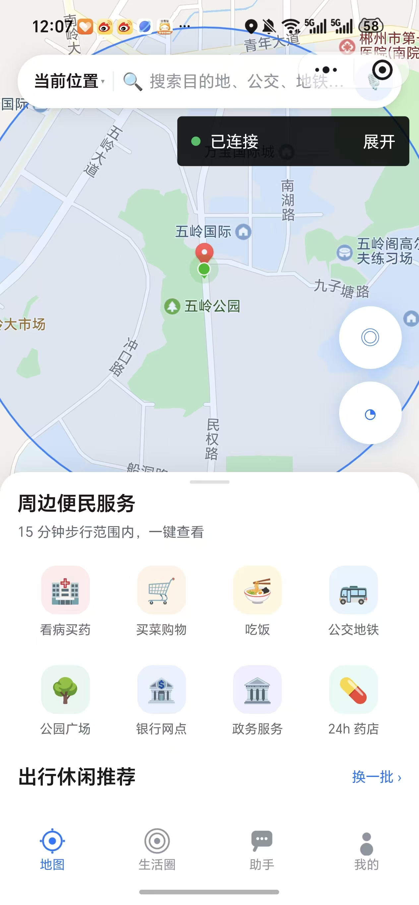

<div align="center">

# 🐟 鲤慧 · LiHui

**基于百度地图开放能力的「15 分钟生活圈」智能体检与规划助手**

*15 分钟，看清你的生活半径。*


</div>

---

## 📖 项目简介

**鲤慧**是一套「**一码多端 + 服务端中转 + MCP 工具生态**」的地图智能助手：

- 客户端只负责「**呈现 + 采集**」；
- 百度地图能力、大模型调用、MCP 工具调度、Token 计量全部由服务端**统一中转**；
- 从而做到三件事：**AK 不落端、能力可插拔、成本可核算**。

围绕赛题核心「15 分钟生活圈」，鲤慧为每一类人群回答三个问题：

> 🏥 我的生活圈**缺什么**？（六类设施体检评分）
> 🚶 缺的东西**去哪补**？（周边检索 + 路线规划）
> 💬 补的过程**谁帮我**？（AI 助手 · MCP 工具编排 · 语音交互）

---

## 📱 真机一览

| 地图主页 · 便民服务 | 15 分钟生活圈 | 生活圈体检报告 |
|:---:|:---:|:---:|
|  |  |  |

| 个性化生活圈方案 | AI 助手 | Token 用量 · 平台信息 |
|:---:|:---:|:---:|
|  |  |  |

---

## ✨ 核心功能

### 🆓 免费基础版（开箱即用，无需任何 Key）

| 功能 | 说明 |
|---|---|
| 📍 **IP 自动锚定** | 端上 GPS 校正 → 百度 IP 定位 → 逆地理补区县 → 内置城市兜底，四级策略链 |
| 🎯 **生活圈体检** | 六类设施加权评分（医疗 25% · 商业 20% · 交通 20% · 教育 15% · 餐饮 10% · 休闲 10%），短板定位 + 步行可达分析 |
| 🔍 **周边便民检索** | 看病买药 / 买菜购物 / 公交地铁 等 8 类一键直达，复合关键词自动拆分检索 |
| 🗺 **路线规划** | 步行 / 骑行 / 驾车（实时避堵）/ 公交四种模式，省钱方案对比 |
| 🗣 **语音交互** | 录音 → 识别 → 播报全链路，自定义音色 / 语速 / 方言 / 唤醒词 |
| 👵 **关怀模式** | 一键适老化：大字号、高对比（WCAG AAA）、慢速语音、单步引导 |
| 💰 **Token 计量** | 按天 / 设备 / 模型聚合记账，配额校验，本机实测 313 Token ≈ ¥0.0004 |

### 🔑 接入 API 后（能力全开）

| 功能 | 说明 |
|---|---|
| 🤖 **AI 助手** | 意图识别 → MCP 工具编排 → 汇总生成人性化回复 + 结构化卡片 |
| 🌐 **多供应商模型** | OpenAI 兼容 / Anthropic / Gemini / Ollama / 百度千帆 / DeepSeek，客户端可视化增删改测 |
| 🧩 **MCP 工具生态** | 8 个 MCP Server 即插即用，支持从 ModelScope 检索安装 |
| ☀️ **天气与景区** | 实时天气 + AQI，周边出行休闲推荐 |
| 🖥 **桌面动作** | 生成 `baidumap://` 等 URI Scheme，一键跳转地图 App 导航 |

---

## 🏗 系统架构

```
┌─────────────────────────── 客户端层（只做呈现与采集） ───────────────────────────┐
│  01-lh-uniapp-多端APP  (Android / HarmonyOS / iOS)     02-lh-wechat-mp (微信小程序) │
│   · <map> 底图渲染            · 百度地图 AK 直连(小程序端)                        │
│   · 语音采集/播报             · 其余能力统一走服务端                             │
└───────────────────────────────┬─────────────────────────────────────────────────┘
                                │ HTTPS  (X-Device-Id / X-Plan)
┌───────────────────────────────▼─────────────────────────────────────────────────┐
│                        03-lh-server（能力中转 + 编排）                            │
│  /api/v1/ip/locate     自动锚定用户 IP → 城市/坐标/运营商                        │
│  /api/v1/map/*         百度地图 Web 服务 API 代理（AK 仅存服务端，端上不可见）      │
│  /api/v1/agent/chat    Agent 编排：意图 → 工具 → 汇总 → 人性化回复                │
│  /api/v1/mcp/*         MCP Server 注册 / ModelScope 下载 / 启停                   │
│  /api/v1/model/*       用户自定义模型与 API Key（6 类供应商）                     │
│  /api/v1/voice/*       自定义语音（音色、语速、唤醒词、TTS 供应商）               │
│  /api/v1/token/*       Token 计量与配额                                          │
└───────────────────────────────┬─────────────────────────────────────────────────┘
                                │ MCP (JSON-RPC 2.0 over stdio)
┌───────────────────────────────▼─────────────────────────────────────────────────┐
│                     04-lh-mcp-servers（工具生态，即插即用）                       │
│  baidu-map · life-circle · cost-optimizer · ip-anchor                            │
│  desktop-action · emotion · voice · feedback                                     │
└─────────────────────────────────────────────────────────────────────────────────┘
```

> **Agent = MCP Client**：`03-lh-server/src/mcp/client.js` 实现完整 MCP 客户端，
> 启动时逐个拉起 MCP Server（stdio 子进程，崩溃自动重启 ≤3 次），
> `initialize → tools/list` 完成能力发现，按用户意图 `tools/call`，支持 `toOpenAITools()` 转 function-calling。

---

## 📦 目录结构

```
鲤慧-LiHui/
├── 00-设计文档/            # 产品与架构 · UI 规范 · 接口文档 · 部署指南 · 设计令牌
├── 01-lh-uniapp-多端APP/   # uni-app 工程 → Android / HarmonyOS / iOS
├── 02-lh-wechat-mp/        # 微信原生小程序工程
├── 03-lh-server/           # Node.js 零依赖服务端（50+ 路由）
├── 04-lh-mcp-servers/      # 8 个独立 MCP Server
├── docs/screenshots/       # 真机截图
└── README.md
```

> ⚠️ **五个包完全独立**：各自拥有 `package.json` / `manifest.json` / `project.config.json`，
> 无共享目录、无跨包相对引用，删掉任意一个包，其余照常编译。

---

## 🚀 快速开始

### ① 启动服务端（Node ≥ 18，零依赖）

```bash
cd 03-lh-server
cp .env.example .env        # 填入你的百度地图服务端 AK
node src/app.js             # 默认 0.0.0.0:8809
```

### ② 微信小程序

```
微信开发者工具 → 导入项目 → 目录选择 02-lh-wechat-mp/
（项目根必须精确到含 app.json 的这一层）
```

真机调试：`utils/config.js` 的 `dev` 改为电脑局域网 IP（如 `http://192.168.0.106:8809`），
手机与电脑连同一 WiFi，并放行防火墙 8809 入站。

### ③ 多端 APP（Android / HarmonyOS / iOS）

```
HBuilderX → 打开目录 01-lh-uniapp-多端APP/ → 运行到手机或模拟器
发行：Android 云打包(.apk) / HarmonyOS(.hap) / iOS(.ipa)
```

### ④ 单独运行某个 MCP Server

```bash
cd 04-lh-mcp-servers/baidu-map
node index.js               # stdio JSON-RPC 2.0，可用任意 MCP Client 挂载
```

### ⑤ Docker 一键部署（推荐服务器场景）

> ⚠️ **必须在项目根目录执行**（`D:/鲤慧-LiHui`），**不是** `03-lh-server/` 子目录。
> Dockerfile 里的 `COPY` 路径带 `03-lh-server/` 前缀，在子目录构建会直接 COPY 失败。

```bash
# ① 准备环境变量（compose 自动读取根目录 .env）
cp .env.example .env
#    编辑 .env：必填 BAIDU_AK，强烈建议同时填 LLM_API_KEY / LLM_MODEL

# ② 一键部署 + 自动自检（推荐）
bash scripts/docker-deploy.sh

# ③ 或手动
docker compose up -d --build            # 构建并后台启动
docker compose logs -f lihui-server     # 看日志
curl http://127.0.0.1:8809/api/v1/health # 健康检查
```

原生 docker（不用 compose）：

```bash
docker build -t lihui-server .          # 同样在根目录执行
docker run -d --name lihui -p 8809:8809 \
  -e BAIDU_AK=<你的百度AK> \
  -e LLM_BASE_URL=https://dashscope.aliyuncs.com/compatible-mode/v1 \
  -e LLM_API_KEY=<你的DashScopeKey> -e LLM_MODEL=qwen-flash \
  -v lihui-data:/app/data lihui-server
```

> 镜像基于 `node:22-alpine`；服务端与全部 MCP Server **均零依赖**（只用 node 内置模块），无需 `npm install`；
> AK 通过环境变量注入，**不写进镜像**；`data/` 运行时数据（Token 账本、反馈）走 Docker 卷持久化。
> 镜像内已包含 `04-lh-mcp-servers/`（MCP 子进程目录，位置 `/04-lh-mcp-servers`，与 `config.mcp.dir` 解析结果一致）。

**部署后自检三项**（缺一项就是部署有问题）：

| 检查项 | 命令 | 期望 |
|---|---|---|
| 服务存活 | `curl http://127.0.0.1:8809/api/v1/health` | 200 |
| 云端模型 | `curl http://127.0.0.1:8809/api/v1/model/active` | 有 `hasKey: true` 的云端模型 |
| MCP 进程 | `curl http://127.0.0.1:8809/api/v1/mcp/list` | `baidu-map` / `life-circle` 等全部 `running` |

---

#### 部署失败报错对照表

| 报错 / 现象 | 原因 | 解决 |
|---|---|---|
| `COPY failed: no source files were specified`<br>或 `failed to compute cache key` | 在 `03-lh-server/` 里执行了 `docker build` | 回到项目根目录执行；compose 的 `build.context` 也是 `.` |
| `The BAIDU_AK variable is not set` | 老版本 compose 用了 `${BAIDU_AK:?}` 强制变量，未设置直接退出 | 已改为 `${BAIDU_AK:-}`；现在只需建 `.env` 填入即可 |
| 容器 `health` 是 200，但所有检索/生活圈/导航**没数据** | **镜像内缺 `04-lh-mcp-servers`**（旧版 Dockerfile 漏 COPY，MCP 子进程 spawn ENOENT） | 已修复，执行 `docker compose up -d --build` 重建镜像；或进容器确认 `docker exec lihui-server ls /04-lh-mcp-servers` |
| `/model/active` 没有云端模型、回答退化成纯规则 | 容器里没有 `data/models.json`，且未注入 `LLM_API_KEY` | 在 `.env` 填 `LLM_BASE_URL` / `LLM_API_KEY` / `LLM_MODEL` 并重启 |
| `docker: command not found` | 没装 Docker，或 Docker Desktop 未启动 | 装 Docker Desktop 并启动托盘服务 |
| 起得来但外部访问不通 | 宿主机防火墙未放行 8809；或服务器安全组没开 | 开端口 8809；确认 `HOST=0.0.0.0`（容器内默认如此） |
| `bind: address already in use` | 8809 被本机另一个服务端进程占用（宿主机直跑的那份） | `netstat -ano \| findstr :8809` 找到 PID 结束掉，或改 `PORT` |

### ⑥ 腾讯云托管 / 微信云托管部署（CloudBase Run）

> 这一节单独写，是因为**云托管的部署判定规则和 Docker 不一样**，最容易踩的是端口。

**① 选代码**
- 仓库：`https://gitee.com/deng-he-ziyan/lihui.git`，分支 `master`
- **代码包根目录必须是项目根**（`Dockerfile` 在根）。云托管不会再往下找子目录，
  也不要把「构建目录」设成 `03-lh-server`（那会让 `COPY 03-lh-server/src` 直接找不到文件）

**② 容器端口（最关键，错了必判部署失败）**

服务端监听端口取值优先级：

```
运行时环境变量 PORT  >  容器内默认 80  >  物理机裸跑 8809
```

- 镜像已默认 `ENV PORT=80`，和云托管最常用的容器端口 80 对齐
- 如果你控制台容器端口填的是 **8080 / 3000 / 其他**，在「环境变量」里显式加
  `PORT=8080` 覆盖即可
- 代码侧还有一层保底：检测到 `/.dockerenv`（确实在容器里）且没传 `PORT` 时，
  默认端口也取 80，不会退回 8809
- 官方判定：端口不一致 → `Readiness probe failed: dial tcp ...:80: connect: connection refused`
  → 即使服务已经正常跑起来、MCP 也 8/8 全绿，平台也一律判「部署失败」
- **部署成功后第一件事**：看「运行日志」前两行，应出现
  `鲤慧服务端已启动 http://127.0.0.1:80`，冒号后面这个数字必须等于你控制台填的端口

**③ 环境变量（服务设置 → 环境变量，必填）**

| 变量 | 值 | 说明 |
|---|---|---|
| `PORT` | 与容器端口一致，如 `80` | 不加会在未注入时回落 8809 |
| `BAIDU_AK` | 百度地图服务端 AK | 不加则地图检索/公交/天气全无数据 |
| `LLM_BASE_URL` | `https://dashscope.aliyuncs.com/compatible-mode/v1` | 云端 Qwen |
| `LLM_API_KEY` | DashScope Key | 不加则无云端模型、无联网检索 |
| `LLM_MODEL` | `qwen-flash` | |
| `HOST` | `0.0.0.0` | 默认就是，不监听 0.0.0.0 平台判失败 |

**④ 数据持久化**
- 「服务设置 → 数据持久化」把容器路径挂到 **`/app/data`**（Token 账本 / 会话 / 反馈 / 模型配置都在这）
- 不挂的话，容器一重建，当天 Token 配额与会话历史就没了

**⑤ 实例规格**
- 主进程会拉起 8 个 MCP stdio 子进程（node 多进程），
  **建议 ≥ 1GB 内存**；选最低规格容易 OOM 反复重启，日志里表现为 `check pod status is not ok`

**⑥ 部署后自检**
```
curl https://<你的云托管默认域名>/api/v1/health
curl https://.../api/v1/model/active     # 要看到 hasKey: true
curl https://.../api/v1/mcp/list         # baidu-map / life-circle 必须 running
```

**⑦ 云托管专属踩坑清单**

| 现象 | 原因 | 处理 |
|---|---|---|
| 「部署失败」但业务日志显示服务已正常启动、`MCP: 8/8 运行中` | **端口不一致**（最常见） | 看启动日志 `已启动 http://127.0.0.1:xxx` 的数字，改成和控制台容器端口一样；镜像默认 80，填其他端口时记得在环境变量加 `PORT=xxx` |
| 无报错日志、控制台一片空白 | 构建超时（>10 分钟） | 检查是否卡在拉 `node:22-alpine`；国内网络可换国内镜像源 |
| `network connection aborted` | 拉国外镜像源不稳 | 换国内镜像源的基础镜像 |
| `xxx: no such file or directory` | COPY 的文件被忽略或路径错 | 检查 `.gitignore` / `.dockerignore` 没排除 `04-lh-mcp-servers`、`03-lh-server/src` |
| `check pod status is not ok` / 反复重启 | 内存 OOM（MCP 子进程多） | 升规格到 ≥1GB |
| 部署成功但检索全无数据 | 没在环境变量里填 `BAIDU_AK`；或旧版本镜像缺 `04-lh-mcp-servers` | 重填 AK 并重新部署；重建镜像 |
| 部署成功但回答退化为纯规则 | 环境变量没填 `LLM_API_KEY` | 填入 DashScope Key 后重新部署 |
| 多行独立 `CMD` 只有最后一行生效 | 旧写法 | 已改为单行 shell + `exec` |

---

## 🧩 MCP 工具清单（16+）

| MCP Server | 工具 | 能力 |
|---|---|---|
| `baidu-map` | geocode / reverse_geocode / poi_search / route_plan / weather / scenic_recommend | 百度地图全能力 |
| `life-circle` | diagnose / customize_plan / service_rating | 生活圈体检与个性化方案 |
| `cost-optimizer` | optimize_plan / promo_push | 出行成本优化 |
| `ip-anchor` | locate / batch_locate | IP 定位锚定 |
| `desktop-action` | open_app / desktop_operate | 跨 App 跳转（安全白名单） |
| `emotion` | soothe / detect_mood | 情绪安抚（含心理援助热线） |
| `voice` | list_speakers / tts_plan / asr_hint | 语音能力规划 |
| `feedback` | submit / list_pending / handle / summary | 反馈闭环 |

---

## 🔑 密钥与安全

| 密钥 | 位置 | 说明 |
|---|---|---|
| 百度服务端 AK | `03-lh-server/.env`（不入库） | 多端共用，**绝不进客户端包** |
| 百度小程序 AK | `02-lh-wechat-mp/utils/config.js` | 仅小程序端直连，需绑定 AppID 白名单 |
| LLM API Key | 客户端「我的 → 模型设置」可视化录入，或 `.env` 全局兜底 | 支持遮蔽显示 |

---

## 🛠 技术栈

`微信原生小程序` · `uni-app (Vue2)` · `Node.js 零依赖 (node:http)` · `MCP 2024-11-05 协议` · `JSON-RPC 2.0 stdio` · `高德风格设计语言 #1677FF`

---

## 🗺 Roadmap

- [x] 微信小程序端全功能
- [x] uni-app 多端工程（Android / HarmonyOS / iOS）
- [x] MCP Server 生态 + Agent Client 编排
- [x] Token 计量与配额体系
- [ ] HTTPS 域名部署 + Nginx 反代（见 `00-设计文档/04-部署与发布指南.md`）
- [ ] ModelScope 一键安装 MCP Server
- [ ] 生活圈历史体检对比

---

## 📄 License

[MIT](LICENSE) © 邓何子彦（deng-he-ziyan）

<div align="center">
<sub>Built with 🗺 百度地图开放能力 · Powered by MCP Protocol</sub>
</div>
