<h1 align="center">🐟 鲤慧 LiHui</h1>

<p align="center"><b>15 分钟生活圈，交给 AI 体检与规划。</b></p>
<p align="center">一句话说清「我家周边缺什么、去哪儿最方便、怎么走最省力」。<br>真实路网算路 · 真实店铺 · 真实步行距离 —— 不玩虚的。</p>

<p align="center">
  🇨🇳 中文 · <a href="README.en.md">🇺🇸 English</a>
</p>

<p align="center">
  <a href="https://gitee.com/deng-he-ziyan/lihui/releases"></a>
  
  
  
  
  <a href="https://gitee.com/deng-he-ziyan/lihui"></a>
</p>

<p align="center">
  <a href="https://github.com/DENGHEZI/lihui/actions/workflows/ci.yml"></a>
  
  
  <a href="https://lihui-landing.app.workbuddy.host/"></a>
</p>

<p align="center">
  <a href="#1-为什么需要鲤慧">1. 为什么需要</a> ·
  <a href="#2-功能一览">2. 功能一览</a> ·
  <a href="#3-架构亮点">3. 架构亮点</a> ·
  <a href="#4-快速上手">4. 快速上手</a> ·
  <a href="#5-常见问题">5. 常见问题</a> ·
  <a href="#6-文档">6. 文档</a> ·
  <a href="#7-参与与反馈">7. 参与与反馈</a> ·
  <a href="#8-生态与技术栈">8. 生态</a> ·
  <a href="#9-关于比赛与团队">9. 关于</a>
</p>

<p align="center">
  
</p>
<p align="center"><sub>↑ 网页版工作台首屏（白色主题 · 金 #b98629 · Linear/Apple 式细线边框与留白）；下方 §2 附 8 视图全景动图</sub></p>

## ✨ 核心特性

- 🗺 **真实路网算路**：等时圈沿真实步行路网 36 方向二分收敛，不画直线圆。
- 🏪 **真实店源数据**：百度 POI 实时检索，步行距离 + 时长实测，非离线模拟。
- ⚖️ **真实权重评分**：体检权重来自《社区生活圈规划技术指南》（TD/T 1062—2021）与上海/长沙/深圳/苏州五部城市规范（按城市自动匹配），POI 去重后计数，评分可对标规范原文。
- 🔐 **隐私合规三端**：版本化隐私政策 + 画像采集前置同意 + 撤回/导出/删除自助权，网页端 / 小程序端 / 服务端（6 端点）口径一致。
- 🤖 **AI 智能助手**：RRF 三通道检索 + LLMWiki 词条图，标准原文注入、引用带编号出处。
- 🧪 **E2E 安全 + 浏览器沙箱**：459 条攻击用例全绿，CSP 沙箱响应头三路生效。
- 🔑 **AK 池自愈**：百度地图多钥匙轮换，配额打满自动冷却切换，Key 掉线零人工干预。
- ⚡ **体检提速**：报告级缓存 + 并发去重 + 类内 12s 熔断 + 受控并发检索，热启动毫秒级、最坏路径不再被单类拖垮。
- 📦 **零第三方依赖**：服务端纯 Node 标准库，前端 Leaflet 本地化，Gitee 推送即部署。

## 1. 为什么需要鲤慧？

「我家门口看病方便吗？」「15 分钟能走到几家店？」「老人一个人在家，缺什么配套？」——回答这些问题，多数工具给你一个**直线半径圆**和**离线模拟数据**，看着像那么回事，其实走不到。

**鲤慧把每一个距离都当真的。** 体检用真实路网算路，等时圈按步行 36 方向实测收敛，商城距离是**走路实测的分钟数**，店源是百度地图里的真实门店——所有结论可复现、可对标国际标准。

|                    | 常见「生活圈」工具            | 鲤慧 LiHui                                          |
| ------------------ | ---------------------------- | --------------------------------------------------- |
| **可达范围**       | 直线半径圆（鸟飞的）         | routematrix 批量矩阵算路，36 方向沿真实路网收敛     |
| **商圈距离**       | 直线距离或写死的假数据       | 步行 222m·约3分钟 —— 真实步行距离 + 步行时长实测    |
| **店源**           | 离线模拟数据                 | 百度 POI 实时构建 102 家真实门店（评分/品类标签透传） |
| **评分权重**       | 拍脑袋自造权重、重复 POI 凑数 | 五部城市规范 categoryWeights 按城市匹配 + POI 去重计数，权重来源随报告透出 |
| **分析速度**       | 每次全量重算                 | 报告级缓存 + 并发去重 + 类内 12s 熔断：热启动毫秒级   |
| **专业口径**       | 自造指标                     | GB 50180 / ISO 37120 / SDG 11，RAG 检索原文引用     |

适合社区规划调研、房产选址看配套、适老化改造评估、比赛演示——一切需要说清「15 分钟内到底能不能走到」的场景。

## 2. 功能一览

### 💻 网页版工作台（V1.0.18~V1.0.27 · 白金高级化）

**👉 在线体验：<https://lihui-landing.app.workbuddy.host/>**（与小程序同一后端、同一套数据）

<p align="center"></p>
<p align="center"><sub>↑ 网页版动图漫游：白色主题 · 金 #b98629 主色 · Linear/Apple 式细线边框与留白 · 8 独立视图自动切换</sub></p>

- **白色 + 金色为主色调**：白底细线边框、金色 `#b98629` 点睛，Linear / Apple 式克制留白的高级感；
- **8 个独立视图**：工作台（AI 对话首屏）· 生活圈体检 · 步行等时圈 · 便民速查 · 账号管理 · **模型接口** · 安全运维 · API 接口手册，侧栏切换不再滚动锚点；
- **智能规划助手**：首屏大输入框直接问，回答引用真实 POI 与标准编号；AI 状态徽标实时显示「已就绪 / 未配置 KEY」，规则兜底回复明示并一键跳转配置；
- **模型接口页**：新增 / 编辑 / 测试 / 设默认 / 删除模型渠道，与小程序「设置 · 模型配置」同一套配置库双端同步，明文 Key 永不回显；
- **账号双端同步**：同一账号体系，昵称 / 头像 / Token 统计任一端修改另一端即生效。

### 🩺 生活圈体检

医疗、教育、商业、交通、餐饮、休闲、养老七类设施加权评分，每类给出**最近设施、步行可达数（去重后）、达标线**，短板一项项列清楚，最后给出 0-100 总分。

**评分为什么可信（V1.0.12）：**

- **真实权重**：按城市自动匹配适用规范——国家标准 TD/T 1062—2021、上海导则、长沙「一圈两场三道」、深圳 2035、苏州品质提升专项，各规范的 `categoryWeights` 依据其服务要素分级折算（报告返回 `weightSource` / `weightNote` 标注出处）；未收录城市回落国家口径。
- **POI 去重计数**：同 uid 重复收录、「同店不同 uid」脏数据（同名同址）合并后再计数，连锁分店（同名不同址）正常保留——重复 POI 不再推高数量达标度。
- **失败隔离**：单类检索失败不参与计分（区别于「确实没有」），权重归一化后偶发网络抖动不会把总分拉穿。

<p align="center">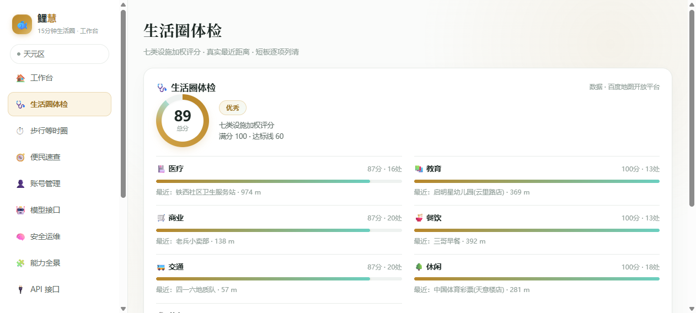</p>
<p align="center">
  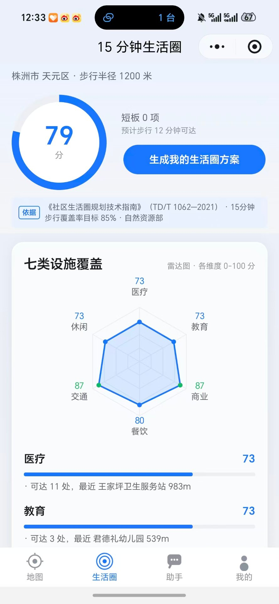&nbsp;&nbsp;
  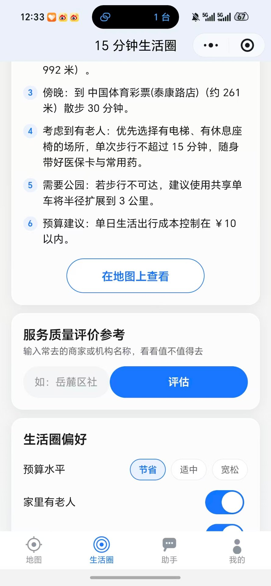
</p>
<p align="center"><sub>↑ 真机实测（非模拟器）：七类设施雷达 / 规划方案</sub></p>

### ⏱ 步行等时圈 · 服务盲区

以家为圆心、36 个方向沿真实路网二分收敛出「N 分钟步行能到哪」，Catmull-Rom 样条连成平滑等时圈；圈内部 N×N 网格逐格评估七类覆盖，加权分 <40 判**服务盲区**（红色格），并对盲区格做二次实测复核。**「真实地图 / 示意图」一键切换**，15/30/45/60 分钟档随点随算。

<p align="center">
  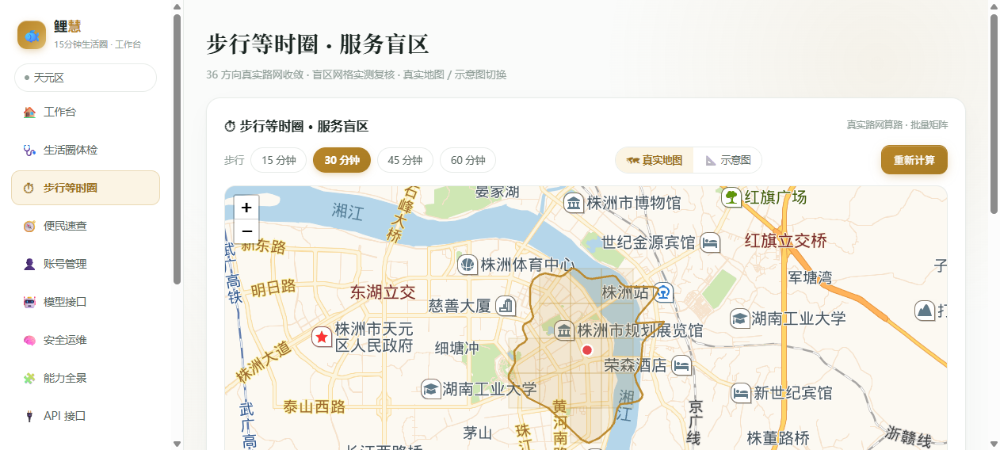
</p>
<p align="center"><sub>↑ 网页版实拍：30 分钟档步行等时圈 —— 36 方向真实路网收敛 · 盲区格分级着色 · 真实地图 / 示意图一键切换 · 15/30/45/60 分钟随点随算</sub></p>
<p align="center">
  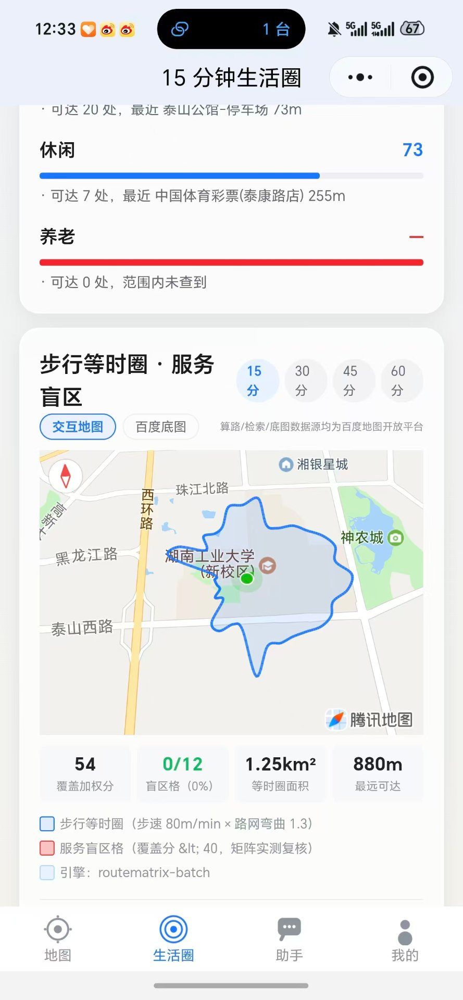
</p>
<p align="center"><sub>↑ 真机实测：小程序端步行等时圈（与网页版同一引擎、同一后端）</sub></p>

<details>
<summary>等时圈是怎么算出来的（算法细节）</summary>

- 扇形采样：36 个方向（每 10°），每方向在时间上限内**二分收敛**「最大步行可达距离」；
- 批量矩阵：每轮把 36 个中点打包成一次 `1×36 routematrix` 批量算路，3 轮收敛——一次体检只烧 3 次算路配额，而不是 36×3 次单点请求；
- 降级链：批量矩阵 → 并发单点算路（令牌桶限流）→ 理想圆（显式标注「降级」，不冒充真算路）；
- 盲区复核：候选盲区格再用一次批量矩阵实测「家→格中心」，插值多边形偏乐观的格直接剔除；
- POI 口径：七类设施与体检共享同一去重/缓存通道（`lifeShared.js`），计数口径完全一致；
- 坐标系统一：全程 GCJ-02，与小程序 `wx.getLocation`、瓦片底图一致。

</details>

### 🐟 智能助手（小程序端）

「附近哪家便利店还开着？」「帮我解读体检结果」「15 分钟生活圈有哪些国际标准可以对标？」——自然语言直接问。答案里的距离、店名、评分都来自工具实查；问到标准/规范/指标时，自动检索**标准知识库**并把原文注入上下文，引用必须带编号出处。

> ℹ️ 该功能仅在**微信小程序端**提供（走云托管内网通道）；网页版不包含助手功能。

<p align="center">
  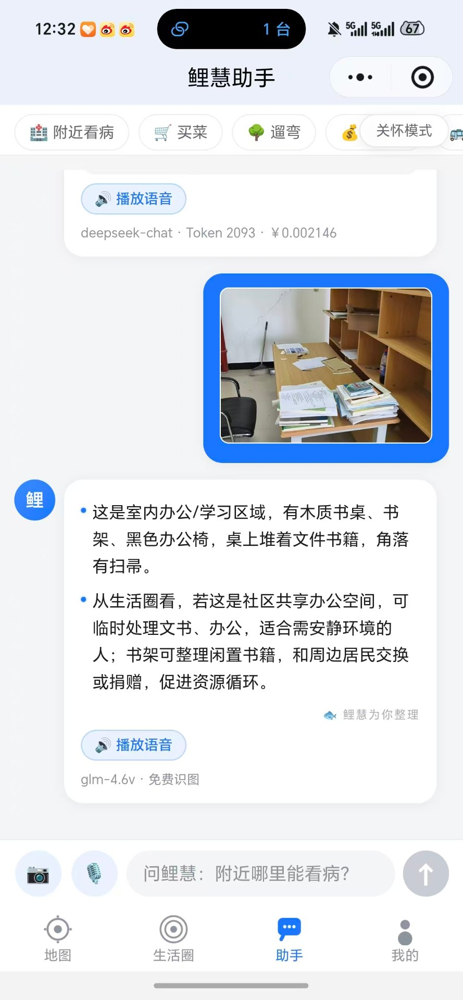&nbsp;&nbsp;
  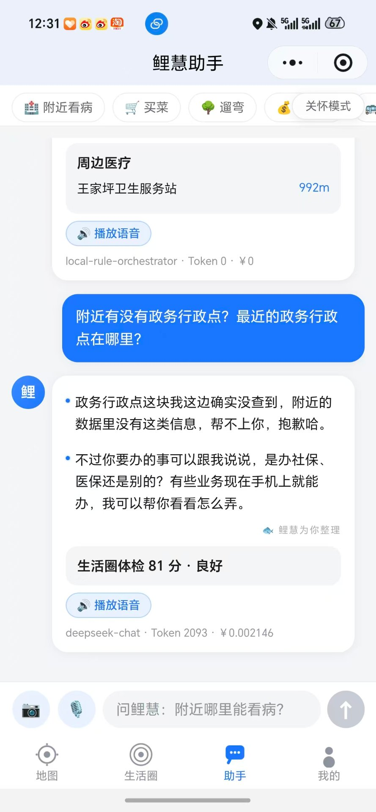&nbsp;&nbsp;
  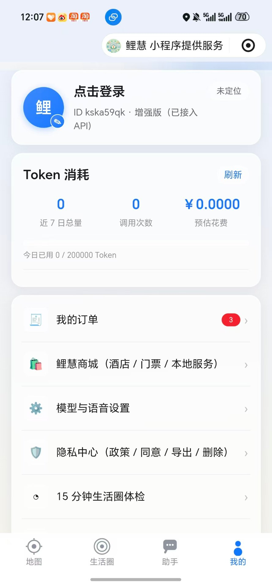
</p>
<p align="center"><sub>↑ 真机实测（非模拟器）：拍照识图 / 兜底问答 / 预算方案</sub></p>

<details>
<summary>回答为什么准：RRF 三通道检索 + LLMWiki 词条图 + 国际标准知识库（RAG）</summary>

- 通用 **RRF（Reciprocal Rank Fusion, k=60）** 工具融合三路检索排名：BM25 字面通道 × 标签/标题通道 × 类目先验通道——单一通道的字面/语义盲区互相补齐（Cormack et al. 2009）；
- **LLMWiki 词条图扩展**：14 部标准互为词条页并以 `related` 互链成图，命中后自动一跳扩展「参见」相关标准 TL;DR——问 ISO 37120 自动带出 SDG 11 / ISO 37122 关联口径，单次检索跨标准联想；扩词条零代码（知识库 JSON 加一条即入图）；
- 知识库收录 **14 部标准 31 段权威要点**：GB 50180-2018、TD/T 1062-2021、上海 15 分钟社区生活圈导则、商务部一刻钟便民生活圈指南、完整社区建设指南、ISO 37120/37101/37122/37170、UN SDG 11、15-Minute City（Moreno）、WHO、LEED-ND、BREEAM；
- 注入提示词强制「**标准编号只能来自注入原文，禁止凭记忆编造**」——大模型对 ISO/GB 编号极易幻觉，必须由知识库供原文；
- 闲聊不触发检索，零 token 浪费；调试接口 `GET /api/v1/agent/standards?q=` 可直接查看融合命中与图扩展结果。

</details>

### 🔐 隐私合规（网页 + 小程序 + 服务端三端）

个性化画像采集**先征得同意**：首次进入弹出隐私提示，同意后才记录搜索/点店/导航偏好；拒绝也照常用全部基础功能。随时可到隐私中心**撤回（停采+删画像）/ 导出（JSON 可携）/ 删除（被遗忘权）**。

- **服务端**：版本化隐私政策（`GET /privacy/policy`）+ 6 个合规端点（consent / withdraw / export / delete…），画像采集服务端同步门控；
- **网页端**：底部同意横幅 + `/privacy` 自助隐私中心页（政策全文 + 同意/撤回/导出/删除按钮）；**三段式精确定位**（浏览器 GPS 高精度 → 网络定位 → IP 兜底，来源与精度实时显示，拒绝授权给出自救指引）；
- **小程序端**：首启同意弹窗 + 「我的 → 隐私中心」全套自助权 + 采集前置门控（`utils/privacy.js`）。

<details>
<summary>隐私端点一览（6 个，全部 admin 视角可审计）</summary>

| 端点 | 作用 |
| --- | --- |
| `GET /privacy/policy` | 版本化隐私政策全文 |
| `POST /privacy/consent` | 记录同意（本地 + 服务端双记，幂等） |
| `GET /privacy/consent` | 查询同意状态 |
| `POST /privacy/withdraw` | 撤回同意（停采 + 立即删除画像） |
| `GET /privacy/export` | 数据导出（可携权，JSON） |
| `POST /privacy/delete` | 数据删除（被遗忘权，需 `confirm:"DELETE"`） |

</details>

<p align="center">
  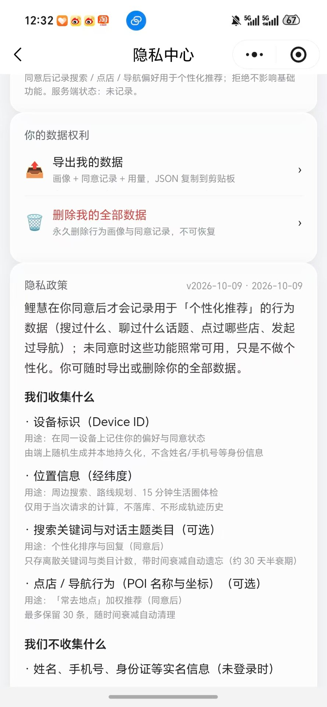&nbsp;&nbsp;
  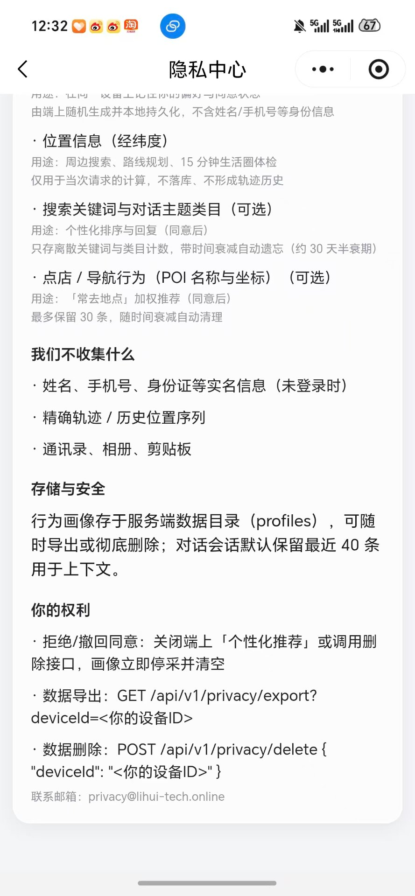
</p>
<p align="center"><sub>↑ 真机实测（非模拟器）：隐私中心 · 数据权利 / 政策详情</sub></p>

### 🛒 附近真实店源

「附近 3km」按定位实时拉真实门店，「本城热门」城市级检索；每家店给**真实步行距离 + 步行时长**（批量矩阵实测，非直线距离），带评分与品类标签，下单按真实店名跳美团/携程小程序直达。

> 🥡 **外卖平台识别（V1.0.7）**：每个门店挂 `platforms` 字段，含美团 / 饿了么 / 抖音「搜这家店」公开深链（`/shop/identify` 可在配了 `*_URL` 真实接口时联网核实在架 / 价格 / 评分）。**默认是引导式识别——服务端不爬取外卖平台、不编造在架状态或价格**，详见 `00-设计文档/06-真实价格接口接入指南.md` 第三节。

<p align="center">
  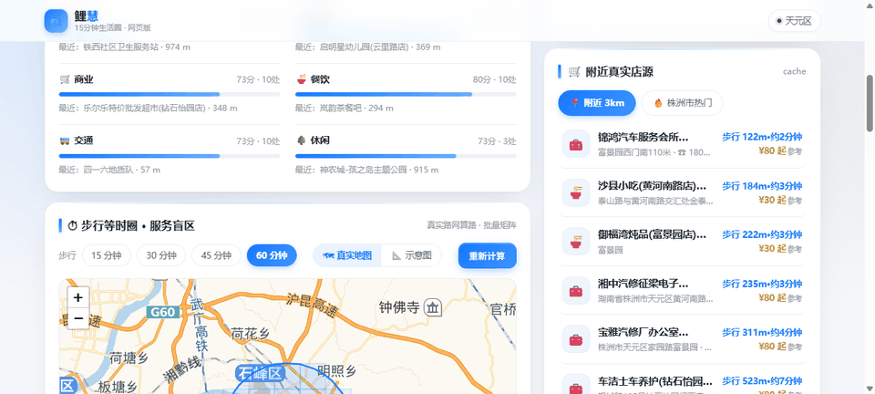
</p>
<p align="center">
  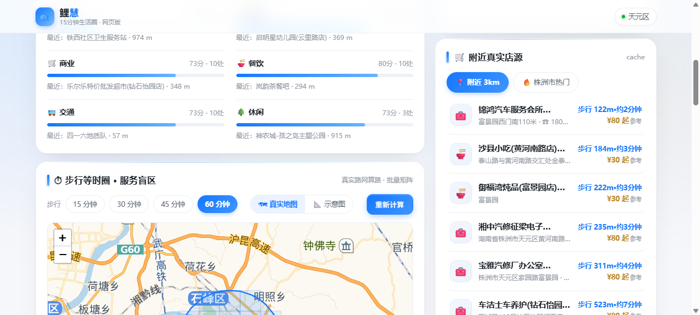&nbsp;&nbsp;
  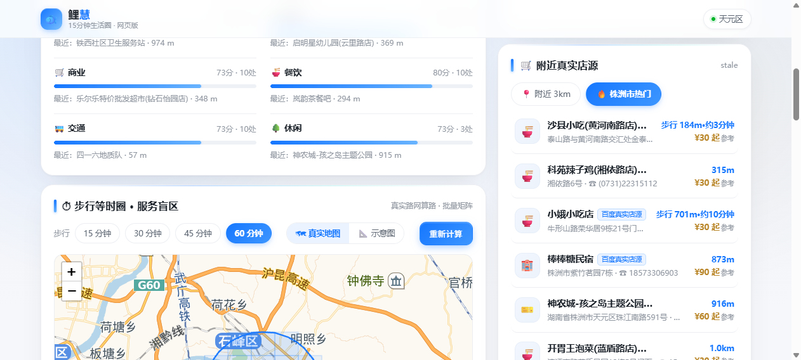
</p>
<p align="center"><sub>↑ 功能测试帧图：附近 3km（真实步行距离排序）/ 本城热门（参考价与品类标签）</sub></p>
<p align="center"></p>
<p align="center"><sub>↑ 真机实测（非模拟器）：鲤慧商城 · 附近真实店源</sub></p>

### 📱 小程序端：地图主页 · 语音 · 识图 · 隐私中心

微信小程序同后端：百度底图主页、语音对话与播报（ASR + TTS）、拍照识图（多模态）、订单留痕、明暗主题、隐私中心（政策/同意/撤回/导出/删除）。总包 223.7 KB，测试版扫码即用。

<p align="center">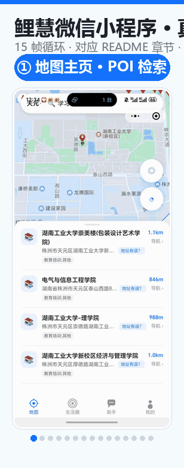</p>
<p align="center"><sub>↑ <b>真机全景漫游（动态循环）</b>：① 地图主页 ② POI 列表 ③ 城市纠偏 ④ 路线规划 ⑤ 等时圈盲区 ⑥–⑦ 生活圈体检 ⑧–⑩ 智能助手 ⑪ 商城 ⑫ 订单 ⑬–⑭ 隐私合规 ⑮ 我的·账号锚定</sub></p>

<details>
<summary>🖼 静态全景大图（15 帧一次看全，点击展开）</summary>

<p align="center">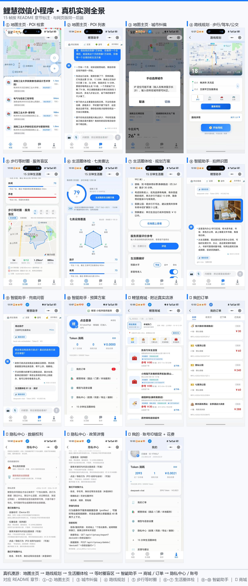</p>

</details>

### 🧠 Memory · 安全运维记忆

人机协同：蜜罐诱捕、IP 封禁、AI 分析（真实 Key 出网前强制脱敏）、**AI 只建议、人批准**，工件落盘由人工合并，学习记忆沉淀运维经验。

<p align="center">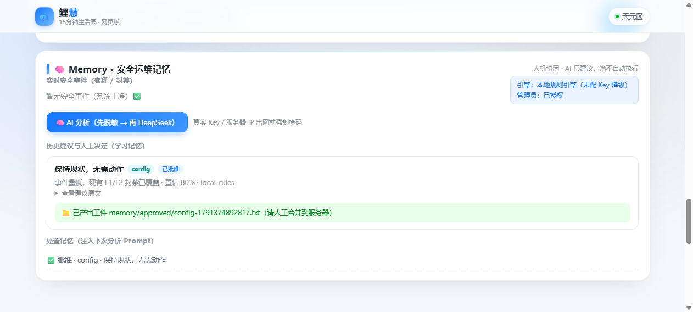</p>

### 🗺️ 八城实测（2026-10-10 · 真实路网 + 真实百度 POI）

同一引擎、同一口径，八个代表城市中心点 15 分钟步行圈的实测结果（原始 JSON 见 [`03-lh-server/docs/city-tests/`](03-lh-server/docs/city-tests/)，可复现）：

| 城市 | 体检总分 | 等级 | 权重口径 | 盲区（格） | 盲区占比 | 治理等级 |
|------|:---:|:---:|------|:---:|:---:|:---:|
| 广州（珠江新城） | 93 | 优秀 | 国家标准 TD/T 1062 | 0 / 23 | 0% | 良好 |
| 佛山（祖庙） | 94 | 优秀 | 国家标准 TD/T 1062 | 0 / 23 | 0% | 良好 |
| 长沙（五一广场） | 97 | 优秀 | **长沙本地规范** | 0 / 27 | 0% | 良好 |
| 成都（春熙路） | 97 | 优秀 | 国家标准 TD/T 1062 | 0 / 27 | 0% | 良好 |
| 西安（钟楼） | 93 | 优秀 | 国家标准 TD/T 1062 | 0 / 17 | 0% | 良好 |
| 哈尔滨（中央大街） | 96 | 优秀 | 国家标准 TD/T 1062 | 0 / 25 | 0% | 良好 |
| 深圳（中心区） | 89 | 优秀 | **深圳 2035 规范** | 0 / 22 | 0% | 良好 |
| 苏州（姑苏区） | 92 | 优秀 | **苏州专项规范** | 1 / 22 | 5% | 良好 |

> 苏州实测抓到一个 **7.18ha 中度盲区热点（缺餐饮）**——网格密度自适应后 6×6 栅格的分辨率收益，5×5 旧口径下会被平均掉。

**盲区判断能力升级（V1.0.26~V1.0.27）：**

- **多档等时圈**：一次算路同时产出 5 / 10 / 15 分钟三档嵌套环（二分探针样本分段线性插值，零额外算路成本），网页版叠加虚线金环 + 分钟标注；
- **网格密度自适应**：≤10 分钟圈自动加密到 7×7、11~20 分钟 6×6、更大 5×5——小半径格距 260~400m，细碎盲区不再被平均掉（显式传 `grid` 仍优先）；
- **盲区分级**：覆盖分 <25 判「严重盲区」（七类几乎全缺，红色深染），25~40 为「中度」（明显短板）——改造优先级一眼可辨；
- **治理等级**：盲区占比 <10% 良好 · 10~25% 一般 · ≥25% 待改善，报告直接给出结论词；
- **热点短板归因**：每个聚类热点标注「缺哪几类」（该类步行超时格占比 ≥50% 才归因），并按 severe 优先 + 面积×缺口强度排序 Top3。

## 3. 架构亮点

| | |
| --- | --- |
| 🧩 **多 Agent 编排** | Orchestrator + 并行专家 Agent + 强类型契约 + 信任分派；规则直调 MCP 工具（杜绝 function-calling 猜工具名）；MCP 自扩展——不确定时自动从 ModelScope 检索并安装新 MCP Server（8s 限时、进程装 3 个上限）。 |
| ⚡ **三道性能闸** | 报告级缓存（量化圆心 10min TTL + SWR 宽限期）→ 并发去重（多端同页共享一次计算）→ 本地引擎优先（与等时圈共享 POI 缓存）。叠加**类内 12s 熔断 + 受控并发检索**，单类故障不再拖垮整份体检。 |
| ⚖️ **可解释评分** | 城市规范 `categoryWeights` 真实权重（报告透出 `weightSource`）+ POI 统一去重（`dedupePOIs`：uid 优先、同名同址合并）+ 失败类剔除与权重归一化；评分单测 19 条回归。 |
| 🔐 **密钥零下发** | 蜜罐假密钥诱捕、出网脱敏、服务端代理、AK 不进前端；扒页面的人拿到废钥匙，一打接口安全日志立刻记下并封禁。 |
| 🔐 **RBAC 鉴权 + 限流** | 三角色最小权限（guest<user<admin），管理/运维端点按 `ROUTE_ROLE` 表强制鉴权；令牌：scrypt 口令 + HMAC-SHA256 签名无状态令牌（类 JWT，零三方库）。令牌桶按身份限速（admin 2000rpm / user 300 / guest 60）+ 单 IP 地板防伪造 device-id，标准 `X-RateLimit-Limit/Remaining/Reset` 头 + 429 `Retry-After`。 |
| 🛡 **隐私合规内建** | 版本化政策 + 同意门控（端上与服务端双保险）+ 撤回/导出/删除自助权 + 定期备份（gzip+sha256 校验、逐文件恢复演练手册 `docs/backup-recovery.md`）。 |
| 🧪 **E2E 安全 + 浏览器沙箱** | 459 条自动化攻击用例（SQLi/XSS/穿越/CRLF/溢出/蜜罐/RBAC/限流…）首跑全绿；CSP 沙箱响应头三路生效——外域脚本、iframe 嵌套、追踪像素被浏览器直接拒绝。 |
| 🔑 **AK 池自愈** | 百度地图 AK 支持多钥匙轮换：配额打满/被停用自动冷却切换，0 点重置自动回归——Key 掉线不再需要人工干预。 |
| 📦 **零第三方依赖** | 服务端纯 Node 标准库（`node src/app.js` 即起，无需 npm install）；前端 Leaflet 本地化，无 CDN 运行时依赖；Gitee push → 云托管自动构建部署。 |
| 🗺 **坐标系纪律** | 全站统一 GCJ-02（定位 / 检索 / 算路 / 瓦片一致），混用偏移 500-900m 的坑在代码注释里都有案底。 |

## 4. 🚀 快速上手

**网页版（最快体验）**

```bash
cd 03-lh-server
node src/app.js        # 零依赖，无需 npm install
# 打开 http://localhost:8809
```

**微信小程序（测试版）**

| 入口 | 说明 |
| :---: | --- |
|  | 微信扫码打开测试版（总包 223.7 KB，地图主页 / 商城 / 语音 / 识图全功能） |

**接口自述**：访问 `/server-info` 查看全部端点；服务端日志在 `data/logs`。

**管理员登录与受保护接口**

服务端对管理/运维端点强制 RBAC 鉴权（`guest<user<admin`）。首启自动播种默认管理员（仅库内无用户时），建议上线即改口令并关自注册：

```bash
# 1) 用默认管理员登录，拿到无状态令牌
curl -X POST http://localhost:8809/api/v1/auth/login \
  -H 'Content-Type: application/json' \
  -d '{"username":"admin","password":"lihui-admin-2026"}'
# → {"code":0,"data":{"token":"<JWT 式签名令牌>","user":{"role":"admin"}}}

# 2) 带令牌访问受保护端点（如安全事件看板）
curl http://localhost:8809/api/v1/security/events \
  -H 'Authorization: Bearer <上一步的 token>'

# 3) 角色不足 / 未登录 → 403 / 401；打满速率 → 429（响应含 X-RateLimit-* 头）
```

**功能测试（评分/坐标/等时圈/RRF/存储回归）**

```bash
cd 03-lh-server
for f in tests/*.test.js; do node "$f"; done
# 生活圈评分回归：node tests/lifeScore.test.js
#  - POI 去重计数（重复 uid / 同名同址脏数据不再推高分）
#  - 真实权重归一化 + 五部城市规范权重和校验
#  - 失败类剔除、0 分边界
```

关键环境变量（`.env` 或启动前 export）：

| 变量 | 默认 | 说明 |
| --- | --- | --- |
| `LH_AUTH_SECRET` | 空（退化密钥） | 令牌签名密钥，**≥16 位**，生产必配，否则重启即失效 |
| `LH_ADMIN_USER` / `LH_ADMIN_PASS` | `admin` / `lihui-admin-2026` | 默认管理员账号；库内已有用户则不再播种 |
| `LH_AUTH_ALLOW_REGISTER` | `true` | 公开自注册开关，**生产建议 `false`** |
| `LH_AUTH_ALLOW_LOOPBACK_ADMIN` | `false` | 本机回环是否视为 admin（仅本地无令牌调试用，默认关） |
| `LH_AUTH_TOKEN_TTL_MS` | 7 天 | 令牌有效期 |
| `LH_PRIVACY_REQUIRE_CONSENT` | `true` | 画像采集前置同意门控，`false` 可关（合规默认开） |
| `LH_BACKUP_INTERVAL_H` / `LH_BACKUP_KEEP` | 24 / 14 | 定期备份间隔（小时）与保留份数 |
| `LH_ALERT_*` / `MONITOR_CERT_HOST` | — | 监控告警阈值与 HTTPS 证书巡检目标 |

**安全自检**（服务起着时另开终端）：

```bash
cd 03-lh-server
node tests/security-e2e.mjs   # 459 条攻击用例（含 RBAC/限流），五条铁律断言
```

## 5. ❓ 常见问题

<details>
<summary><b>等时圈 / 体检的数据是真的吗？</b></summary>

是。可达范围由百度 routematrix 批量矩阵算路实测（沿真实路网步行），店源由百度 place 检索实时构建，距离为真实步行距离。降级场景（算路配额熔断）会在返回里显式标注 `degraded`，不冒充真算路。
</details>

<details>
<summary><b>体检分数是怎么算的？权重可靠吗？</b></summary>

七类设施「数量达标度（0.6）+ 类型覆盖度（0.4）」逐类打分，再按**城市规范的真实权重**加权：体检请求带城市名时自动匹配该城市适用的生活圈规范（如深圳轨道主导城市 transit 权重 0.26 最高），`weightSource` 字段透出所用规范全名与出处说明。POI 先去重再计数——同一医院被百度重复收录 4 次也只算 1 家。
</details>

<details>
<summary><b>百度配额用完了会白屏吗？</b></summary>

不会。place 检索有落盘缓存与「配额超限禁用空结果覆盖旧缓存」保护——配额挂了继续用早前同步的真实目录并明确提示；矩阵算路与 place 检索配额池独立。等时圈底图用高德瓦片（免 key），不占百度配额。配额超限还会触发 10 分钟熔断，避免无谓重试拖慢响应。
</details>

<details>
<summary><b>我的行为数据被怎么处理？</b></summary>

在你**同意后**才采集，且只存离散关键词与类目计数（带时间衰减自动遗忘）；未同意时功能照常可用只是不做个性化。隐私中心可随时撤回（停采+立即删画像）、导出全部数据（JSON）、删除全部数据（不可恢复）。政策版本化，变更即提示。
</details>

<details>
<summary><b>商城价格是真实价格吗？</b></summary>

标「参考」的价格为估算（百度 place 不提供成交价）；下单与支付在美团/携程小程序按真实店名完成，鲤慧负责选品与订单留痕，不碰资金。
</details>

<details>
<summary><b>智能助手会编造标准编号吗？</b></summary>

标准类问题会先检索本地标准知识库（RRF 三通道融合），把原文注入模型上下文并强制引用出处；知识库没命中的内容模型会明说查不到。调试接口 `GET /api/v1/agent/standards?q=` 可验证。
</details>

<details>
<summary><b>语音功能需要什么配置？</b></summary>

播报内置微软 Edge 免费合成引擎，零密钥可用；配百度语音密钥后自动切百度音色。语音识别走服务端 ASR 代理，密钥同样不下发端上。
</details>

<details>
<summary><b>受保护接口返回 401/403，或想改管理员口令？</b></summary>

管理/运维端点（安全事件、Memory 分析、MCP 管理、反馈处理等）需 `Authorization: Bearer <token>`。登录拿令牌：`POST /api/v1/auth/login`。

- **改管理员口令**：设 `LH_ADMIN_PASS=新口令` 后重启；或登录后用 `POST /auth/register` 由管理员创建新账号（公开自注册请设 `LH_AUTH_ALLOW_REGISTER=false`）。
- **生产加固**：务必配 `LH_AUTH_SECRET`（≥16 位）、关自注册、关回环豁免（`LH_AUTH_ALLOW_LOOPBACK_ADMIN=false` 默认已关）。
- 角色不足返回 403、未登录 401、打满速率 429（响应含 `X-RateLimit-*` 头）。
</details>

## 6. 📚 文档

| 文档 | 内容 |
| --- | --- |
| [更新日志](CHANGELOG.md) | 按日期记录的完整演进（含每处踩坑与修复，最新 V1.0.15） |
| [贡献指南](CONTRIBUTING.md) | 环境准备 / 提交规范 / 测试要求 / 安全隐私红线 / PR 流程 |
| [产品路线图](ROADMAP.md) | 已完成台账 + 近期（V1.1）/ 中期（V1.2）/ 远期（V2.0）规划 |
| [备份与恢复手册](03-lh-server/docs/backup-recovery.md) | 备份机制、cron 定时、每月恢复演练五步清单 |
| [真机实测图集](docs/screenshots/) | 21-31 号：网页版分段截图与真机实拍 |
| [发行版 v1.0.0](https://gitee.com/deng-he-ziyan/lihui/releases) | 小程序测试版二维码 + 29 张发行图集 |

## 7. 🤝 参与与反馈

- ⭐ **如果鲤慧帮到了你**：欢迎顺手点个 Star —— [Gitee](https://gitee.com/deng-he-ziyan/lihui) · [GitHub](https://github.com/DENGHEZI/lihui)；并在 [Issue](https://gitee.com/deng-he-ziyan/lihui/issues) 里提建议或报 bug（请附系统/浏览器版本、复现步骤与截图）。
- 想贡献代码？请先读 [贡献指南](CONTRIBUTING.md)（环境准备 / 提交规范 / 测试要求 / 安全红线），规划中的方向见 [路线图](ROADMAP.md)。
- 双仓库同步维护：[Gitee（主）](https://gitee.com/deng-he-ziyan/lihui) · [GitHub](https://github.com/DENGHEZI/lihui)，push Gitee 自动触发微信云托管构建部署。

## 8. 🌐 生态与技术栈

鲤慧构建于以下开放能力与自研模块之上：

| 层 | 技术 / 能力 |
| --- | --- |
| 🗺 地图数据 | 百度地图开放平台（routematrix 批量算路、place POI 检索、AK 池自愈）；高德瓦片底图（免 key，不占配额） |
| ⚖️ 评分依据 | TD/T 1062—2021、GB 50180-2018、上海/长沙/深圳/苏州城市规范（`data/standards.json` 版本化，权重按城市匹配） |
| 🤖 AI 编排 | Orchestrator + 并行专家 Agent + 强类型契约 + 信任分派；MCP 8 Servers 即插即用（不确定时自动检索安装新 Server） |
| 🧠 知识检索 | RRF 三通道融合（BM25 × 标签 × 类目先验）+ LLMWiki 14 部标准词条图；零依赖本地向量 |
| 🖥 服务端 | 纯 Node.js 标准库（`node src/app.js` 即起，无 npm install）；report 缓存 + 并发去重 + 监控告警 + 定期备份 |
| 🌐 前端 | Leaflet 本地化（无 CDN 运行时依赖）；网页版 + 微信小程序同源后端 |
| 🔒 安全与合规 | 蜜罐诱捕 + IP 封禁 + 出网脱敏 + CSP 浏览器沙箱 + RBAC 鉴权 + 角色感知限流 + 459 条 E2E 攻击用例 + 隐私政策/同意/导出/删除 |

同源作品线：文途 AI 转码 · 死与生 FPS · 鲤慧科研 Agent（LiyuAgent）。

## 9. 🏆 关于比赛与团队

- **参赛项目**：2026 上海开源创新大赛 · 百度地图赛题「15 分钟生活圈」。
- **出品**：湖南省登丰科技有限公司。
- **理念**：把每一个「15 分钟能不能走到」都算成真距离——真实路网、真实店铺、真实步行时长。
- **许可证**：以开源方式参赛，详见仓库许可证文件。

---

<p align="center"><sub>2026 上海开源创新大赛 · 百度地图赛题「15 分钟生活圈」参赛作品 🐟</sub></p>
