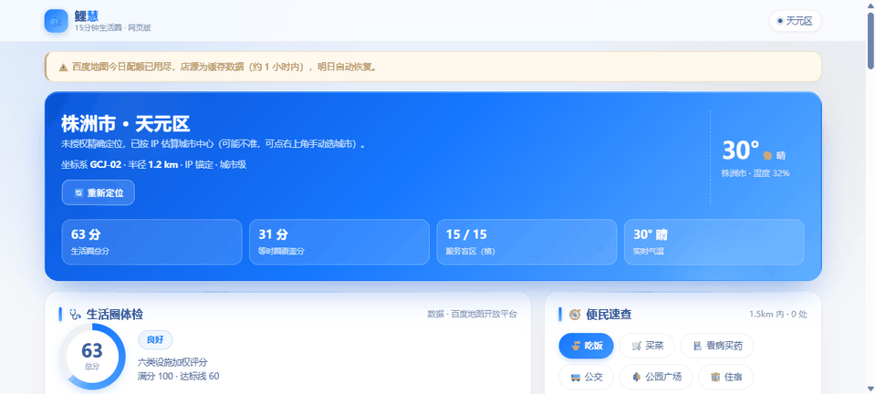
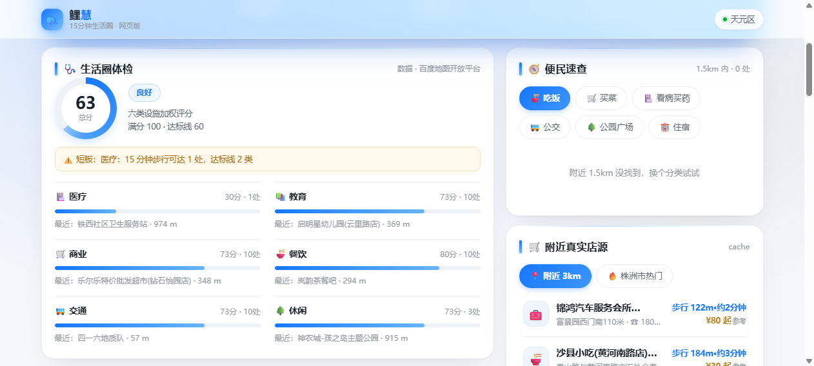
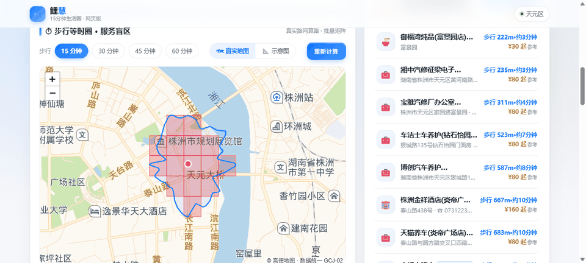
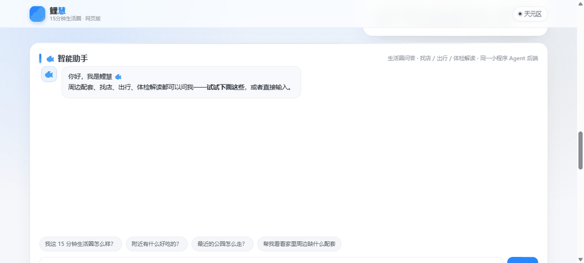
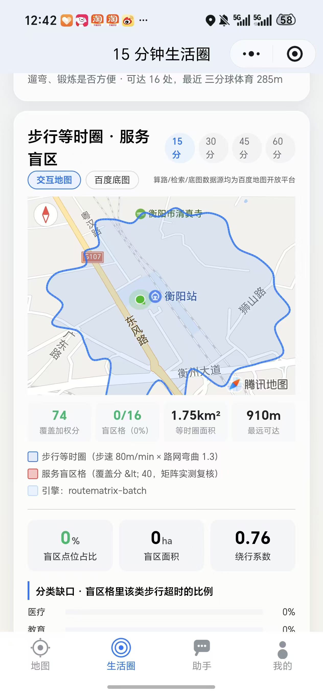

<h1 align="center">🐟 鲤慧 LiHui</h1>

<p align="center"><b>15 分钟生活圈，交给 AI 体检与规划。</b></p>
<p align="center">一句话说清「我家周边缺什么、去哪儿最方便、怎么走最省力」。<br>真实路网算路 · 真实店铺 · 真实步行距离 —— 不玩虚的。</p>

<p align="center">
  🇨🇳 中文 · <a href="README.en.md">🇺🇸 English</a>
</p>

<p align="center">
  <a href="https://gitee.com/deng-he-ziyan/lihui/releases"></a>
  
  
  
  
  <a href="https://gitee.com/deng-he-ziyan/lihui"></a>
</p>

<p align="center">
  <a href="#1-为什么需要鲤慧">1. 为什么需要</a> ·
  <a href="#2-功能一览">2. 功能一览</a> ·
  <a href="#3-架构亮点">3. 架构亮点</a> ·
  <a href="#4-快速上手">4. 快速上手</a> ·
  <a href="#5-常见问题">5. 常见问题</a> ·
  <a href="#6-文档">6. 文档</a> ·
  <a href="#7-参与与反馈">7. 参与与反馈</a> ·
  <a href="#8-生态与技术栈">8. 生态</a> ·
  <a href="#9-关于比赛与团队">9. 关于</a>
</p>

<p align="center">
  
</p>
<p align="center"><sub>↑ 网页版全景漫游：体检评分 → 等时圈真实地图切档 → 商城步行距离 → 智能助手对话（同一后端驱动小程序）</sub></p>

## ✨ 核心特性

- 🗺 **真实路网算路**：等时圈沿真实步行路网 36 方向二分收敛，不画直线圆。
- 🏪 **真实店源数据**：百度 POI 实时检索，步行距离 + 时长实测，非离线模拟。
- 🤖 **AI 智能助手**：RRF 三通道检索 + LLMWiki 词条图，标准原文注入、引用带编号出处。
- 🧪 **E2E 安全 + 浏览器沙箱**：459 条攻击用例全绿，CSP 沙箱响应头三路生效。
- 🔑 **AK 池自愈**：百度地图多钥匙轮换，配额打满自动冷却切换，Key 掉线零人工干预。
- ⚡ **体检提速**：报告级缓存 + 并发去重 + 本地引擎优先，热启动 5.6ms / 冷启动 1.34s。
- 📦 **零第三方依赖**：服务端纯 Node 标准库，前端 Leaflet 本地化，Gitee 推送即部署。

## 1. 为什么需要鲤慧？

「我家门口看病方便吗？」「15 分钟能走到几家店？」「老人一个人在家，缺什么配套？」——回答这些问题，多数工具给你一个**直线半径圆**和**离线模拟数据**，看着像那么回事，其实走不到。

**鲤慧把每一个距离都当真的。** 体检用真实路网算路，等时圈按步行 36 方向实测收敛，商城距离是**走路实测的分钟数**，店源是百度地图里的真实门店——所有结论可复现、可对标国际标准。

|                    | 常见「生活圈」工具            | 鲤慧 LiHui                                          |
| ------------------ | ---------------------------- | --------------------------------------------------- |
| **可达范围**       | 直线半径圆（鸟飞的）         | routematrix 批量矩阵算路，36 方向沿真实路网收敛     |
| **商圈距离**       | 直线距离或写死的假数据       | 步行 222m·约3分钟 —— 真实步行距离 + 步行时长实测    |
| **店源**           | 离线模拟数据                 | 百度 POI 实时构建 102 家真实门店（评分/品类标签透传） |
| **分析速度**       | 每次全量重算                 | 报告级缓存 + 并发去重：热启动 5.6ms，冷启动 1.34s    |
| **专业口径**       | 自造指标                     | GB 50180 / ISO 37120 / SDG 11，RAG 检索原文引用     |

适合社区规划调研、房产选址看配套、适老化改造评估、比赛演示——一切需要说清「15 分钟内到底能不能走到」的场景。

## 2. 功能一览

### 🩺 生活圈体检

医疗、教育、商业、交通、休闲、养老六类设施加权评分，每类给出**最近设施、步行可达数、达标线**，短板一项项列清楚，最后给出 0-100 总分与雷达图。

<p align="center"></p>

### ⏱ 步行等时圈 · 服务盲区

以家为圆心、36 个方向沿真实路网二分收敛出「N 分钟步行能到哪」，Catmull-Rom 样条连成平滑等时圈；圈内部 N×N 网格逐格评估六类覆盖，加权分 <40 判**服务盲区**（红色格），并对盲区格做二次实测复核。**「真实地图 / 示意图」一键切换**，15/30/45/60 分钟档随点随算。

<p align="center">
  
</p>

<details>
<summary>等时圈是怎么算出来的（算法细节）</summary>

- 扇形采样：36 个方向（每 10°），每方向在时间上限内**二分收敛**「最大步行可达距离」；
- 批量矩阵：每轮把 36 个中点打包成一次 `1×36 routematrix` 批量算路，3 轮收敛——一次体检只烧 3 次算路配额，而不是 36×3 次单点请求；
- 降级链：批量矩阵 → 并发单点算路（令牌桶限流）→ 理想圆（显式标注「降级」，不冒充真算路）；
- 盲区复核：候选盲区格再用一次批量矩阵实测「家→格中心」，插值多边形偏乐观的格直接剔除；
- 坐标系统一：全程 GCJ-02，与小程序 `wx.getLocation`、瓦片底图一致。

</details>

### 🐟 智能助手（网页版 + 小程序）

「附近哪家便利店还开着？」「帮我解读体检结果」「15 分钟生活圈有哪些国际标准可以对标？」——自然语言直接问。答案里的距离、店名、评分都来自工具实查；问到标准/规范/指标时，自动检索**标准知识库**并把原文注入上下文，引用必须带编号出处。

<p align="center">
  
</p>

<details>
<summary>回答为什么准：RRF 三通道检索 + LLMWiki 词条图 + 国际标准知识库（RAG）</summary>

- 通用 **RRF（Reciprocal Rank Fusion, k=60）** 工具融合三路检索排名：BM25 字面通道 × 标签/标题通道 × 类目先验通道——单一通道的字面/语义盲区互相补齐（Cormack et al. 2009）；
- **LLMWiki 词条图扩展**：14 部标准互为词条页并以 `related` 互链成图，命中后自动一跳扩展「参见」相关标准 TL;DR——问 ISO 37120 自动带出 SDG 11 / ISO 37122 关联口径，单次检索跨标准联想；扩词条零代码（知识库 JSON 加一条即入图）；
- 知识库收录 **14 部标准 31 段权威要点**：GB 50180-2018、TD/T 1062-2021、上海 15 分钟社区生活圈导则、商务部一刻钟便民生活圈指南、完整社区建设指南、ISO 37120/37101/37122/37170、UN SDG 11、15-Minute City（Moreno）、WHO、LEED-ND、BREEAM；
- 注入提示词强制「**标准编号只能来自注入原文，禁止凭记忆编造**」——大模型对 ISO/GB 编号极易幻觉，必须由知识库供原文；
- 闲聊不触发检索，零 token 浪费；调试接口 `GET /api/v1/agent/standards?q=` 可直接查看融合命中与图扩展结果。

</details>

### 🛒 附近真实店源

「附近 3km」按定位实时拉真实门店，「本城热门」城市级检索；每家店给**真实步行距离 + 步行时长**（批量矩阵实测，非直线距离），带评分与品类标签，下单按真实店名跳美团/携程小程序直达。

<p align="center">
  
</p>

### 📱 小程序端：地图主页 · 语音 · 识图

微信小程序同后端：百度底图主页、语音对话与播报（ASR + TTS）、拍照识图（多模态）、订单留痕、明暗主题。总包 223.7 KB，测试版扫码即用。

<p align="center">
  &nbsp;&nbsp;
  
</p>
<p align="center"><sub>↑ 真机实测（非模拟器）：等时圈盲区页 / 识图 + 语音播报按钮</sub></p>

### 🧠 Memory · 安全运维记忆

人机协同：蜜罐诱捕、IP 封禁、AI 分析（真实 Key 出网前强制脱敏）、**AI 只建议、人批准**，工件落盘由人工合并，学习记忆沉淀运维经验。

<p align="center"></p>

## 3. 架构亮点

| | |
| --- | --- |
| 🧩 **多 Agent 编排** | Orchestrator + 并行专家 Agent + 强类型契约 + 信任分派；规则直调 MCP 工具（杜绝 function-calling 猜工具名）；MCP 自扩展——不确定时自动从 ModelScope 检索并安装新 MCP Server（8s 限时、进程装 3 个上限）。 |
| ⚡ **三道性能闸** | 报告级缓存（量化圆心 10min TTL）→ 并发去重（多端同页共享一次计算）→ 本地引擎优先（与等时圈共享 POI 缓存）。体检热启动 5.6ms、冷启动 1.34s。 |
| 🔐 **密钥零下发** | 蜜罐假密钥诱捕、出网脱敏、服务端代理、AK 不进前端；扒页面的人拿到废钥匙，一打接口安全日志立刻记下并封禁。 |
| 🧪 **E2E 安全 + 浏览器沙箱** | 459 条自动化攻击用例（SQLi/XSS/穿越/CRLF/溢出/蜜罐…）首跑全绿；CSP 沙箱响应头三路生效——外域脚本、iframe 嵌套、追踪像素被浏览器直接拒绝。 |
| 🔑 **AK 池自愈** | 百度地图 AK 支持多钥匙轮换：配额打满/被停用自动冷却切换，0 点重置自动回归——Key 掉线不再需要人工干预。 |
| 📦 **零第三方依赖** | 服务端纯 Node 标准库（`node src/app.js` 即起，无需 npm install）；前端 Leaflet 本地化，无 CDN 运行时依赖；Gitee push → 云托管自动构建部署。 |
| 🗺 **坐标系纪律** | 全站统一 GCJ-02（定位 / 检索 / 算路 / 瓦片一致），混用偏移 500-900m 的坑在代码注释里都有案底。 |

## 4. 🚀 快速上手

**网页版（最快体验）**

```bash
cd 03-lh-server
node src/app.js        # 零依赖，无需 npm install
# 打开 http://localhost:8809
```

**微信小程序（测试版）**

| 入口 | 说明 |
| :---: | --- |
|  | 微信扫码打开测试版（总包 223.7 KB，地图主页 / 商城 / 语音 / 识图全功能） |

**接口自述**：访问 `/server-info` 查看全部端点；服务端日志在 `data/logs`。

**安全自检**（服务起着时另开终端）：

```bash
cd 03-lh-server
node tests/security-e2e.mjs   # 459 条攻击用例，五条铁律断言，~250ms 跑完
```

## 5. ❓ 常见问题

<details>
<summary><b>等时圈 / 体检的数据是真的吗？</b></summary>

是。可达范围由百度 routematrix 批量矩阵算路实测（沿真实路网步行），店源由百度 place 检索实时构建，距离为真实步行距离。降级场景（算路配额熔断）会在返回里显式标注 `degraded`，不冒充真算路。
</details>

<details>
<summary><b>百度配额用完了会白屏吗？</b></summary>

不会。place 检索有落盘缓存与「配额超限禁用空结果覆盖旧缓存」保护——配额挂了继续用早前同步的真实目录并明确提示；矩阵算路与 place 检索配额池独立。等时圈底图用高德瓦片（免 key），不占百度配额。
</details>

<details>
<summary><b>商城价格是真实价格吗？</b></summary>

标「参考」的价格为估算（百度 place 不提供成交价）；下单与支付在美团/携程小程序按真实店名完成，鲤慧负责选品与订单留痕，不碰资金。
</details>

<details>
<summary><b>智能助手会编造标准编号吗？</b></summary>

标准类问题会先检索本地标准知识库（RRF 三通道融合），把原文注入模型上下文并强制引用出处；知识库没命中的内容模型会明说查不到。调试接口 `GET /api/v1/agent/standards?q=` 可验证。
</details>

<details>
<summary><b>语音功能需要什么配置？</b></summary>

播报内置微软 Edge 免费合成引擎，零密钥可用；配百度语音密钥后自动切百度音色。语音识别走服务端 ASR 代理，密钥同样不下发端上。
</details>

## 6. 📚 文档

| 文档 | 内容 |
| --- | --- |
| [更新日志](CHANGELOG.md) | 按日期记录的完整演进（含每处踩坑与修复） |
| [真机实测图集](docs/screenshots/) | 21-31 号：网页版分段截图与真机实拍 |
| [发行版 v1.0.0](https://gitee.com/deng-he-ziyan/lihui/releases) | 小程序测试版二维码 + 29 张发行图集 |

## 7. 🤝 参与与反馈

- ⭐ **如果鲤慧帮到了你**：欢迎顺手点个 Star —— [Gitee](https://gitee.com/deng-he-ziyan/lihui) · [GitHub](https://github.com/DENGHEZI/lihui)；并在 [Issue](https://gitee.com/deng-he-ziyan/lihui/issues) 里提建议或报 bug（请附系统/浏览器版本、复现步骤与截图）。
- 双仓库同步维护：[Gitee（主）](https://gitee.com/deng-he-ziyan/lihui) · [GitHub](https://github.com/DENGHEZI/lihui)，push Gitee 自动触发微信云托管构建部署。

## 8. 🌐 生态与技术栈

鲤慧构建于以下开放能力与自研模块之上：

| 层 | 技术 / 能力 |
| --- | --- |
| 🗺 地图数据 | 百度地图开放平台（routematrix 批量算路、place POI 检索、AK 池自愈）；高德瓦片底图（免 key，不占配额） |
| 🤖 AI 编排 | Orchestrator + 并行专家 Agent + 强类型契约 + 信任分派；MCP 8 Servers 即插即用（不确定时自动检索安装新 Server） |
| 🧠 知识检索 | RRF 三通道融合（BM25 × 标签 × 类目先验）+ LLMWiki 14 部标准词条图；零依赖本地向量 |
| 🖥 服务端 | 纯 Node.js 标准库（`node src/app.js` 即起，无 npm install）；report 缓存 + 并发去重 |
| 🌐 前端 | Leaflet 本地化（无 CDN 运行时依赖）；网页版 + 微信小程序同源后端 |
| 🔒 安全 | 蜜罐诱捕 + IP 封禁 + 出网脱敏 + CSP 浏览器沙箱 + 459 条 E2E 攻击用例 |

同源作品线：文途 AI 转码 · 死与生 FPS · 鲤慧科研 Agent（LiyuAgent）。

## 9. 🏆 关于比赛与团队

- **参赛项目**：2026 上海开源创新大赛 · 百度地图赛题「15 分钟生活圈」。
- **出品**：湖南省登丰科技有限公司。
- **理念**：把每一个「15 分钟能不能走到」都算成真距离——真实路网、真实店铺、真实步行时长。
- **许可证**：以开源方式参赛，详见仓库许可证文件。

---

<p align="center"><sub>2026 上海开源创新大赛 · 百度地图赛题「15 分钟生活圈」参赛作品 🐟</sub></p>
